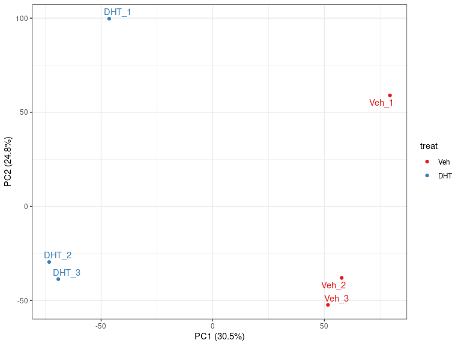
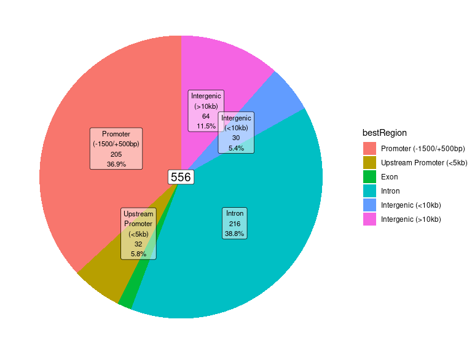
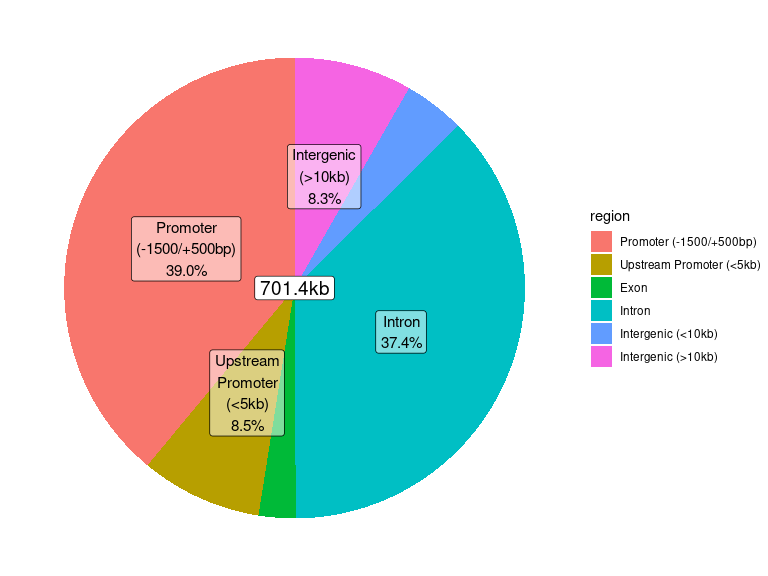
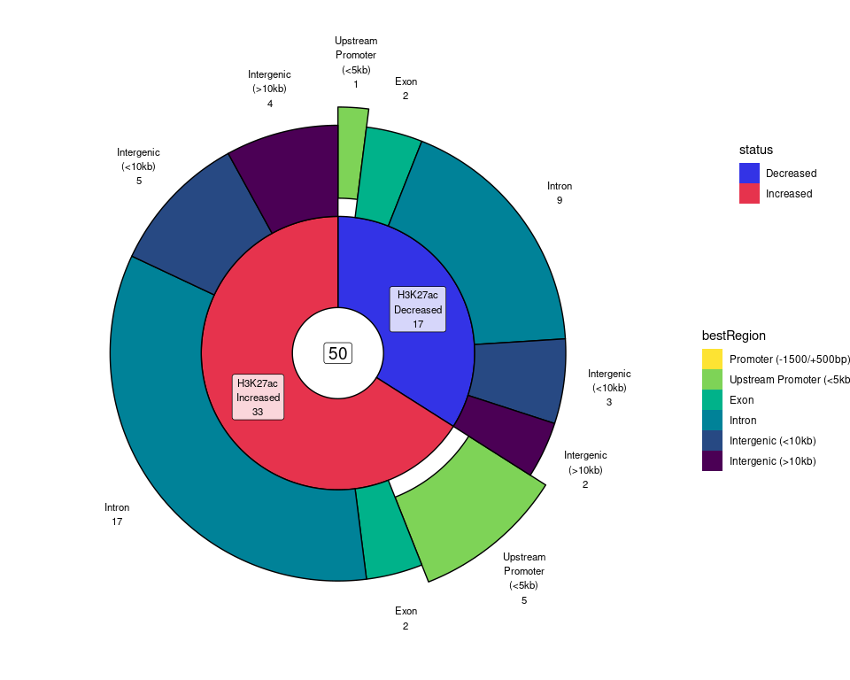

extraChIPs: Differential Signal Analysis
================
true

# Introduction

The [GRAVI](https://github.com/smped/GRAVI) workflow, for which this
package is designed, uses sliding windows for differential signal
analysis in a manner similar to the package `csaw`, but also
incorporating `macs2` peaks. The workflow itself extends to integrating
multiple ChIP targets and external data sources, and as such, this
package introduces a handful of functions to simplify and enable these
analyses. Whilst many existing approaches refer to this type of analysis
as Differential Binding analysis, we prefer the term *Differential
Signal Analysis* as this more accurately captures the range of ChIP
targets which are likely to be investigated.

The majority of examples below use heavily reduced datasets to provide
general guidance on using the functions. Some results may appear trivial
as a result, but will hopefully prove far more useful in a true
experimental context.

# Setup

## Installation

In order to use the package `extraChIPs` and follow this vignette, we
recommend using the package `BiocManager` hosted on CRAN. Once this is
installed, the additional packages required for this vignette
(`tidyverse`, `Rsamtools`, `csaw`, `BiocParallel` and `rtracklayer`) can
also be installed.

``` r
if (!"BiocManager" %in% rownames(installed.packages()))
  install.packages("BiocManager")
pkg <- c(
  "tidyverse", "Rsamtools", "csaw", "BiocParallel", "rtracklayer", "edgeR", 
  "patchwork", "extraChIPs", "plyranges", "scales"
)
BiocManager::install(pkg, update = FALSE)
```

Once these packages are installed, we can load them easily

``` r
library(tidyverse)
library(Rsamtools)
library(csaw)
library(BiocParallel)
library(rtracklayer)
library(edgeR)
library(patchwork)
library(extraChIPs)
library(plyranges)
library(scales)
```

## Data

All data for this vignette is expected to be in a sub-directory of the
working directory named “data”, and all paths will be predicated on
this. Please ensure you have all data in this location.

The data itself is ChIP-Seq data targeting the histone mark H3K27ac, and
is taken from the cell-line MDA-MB-453 under Vehicle and DHT-stimulated
conditions. Using CRCh37 as the reference genome, a subset of regions
found on chromosome 10 are included in this dataset for simplicity.

`Seqinfo` objects are the foundation of working with GRanges, so let’s
define a suitable object for consistency throughout th analysis.

``` r
hg19 <- GenomeInfoDb::getChromInfoFromUCSC("hg19")
grch37 <- hg19 %>% 
  dplyr::filter(chrom %in% paste0("chr", c(1:22, "X", "Y"))) %>% 
  mutate(genome = "GRCh37") %>% 
  dplyr::select(
    seqnames = chrom, seqlengths = size, isCircular = circular, genome
  ) %>% 
  as("Seqinfo")
```

# Working With Peaks

The provided dataset includes six files produced by `macs2 callpeak`
(Zhang et al. 2008) in the `narrowPeak` format, and these are able to be
easily parsed using `extraChIPs`.

``` r
peakFiles <- list.files("data", pattern = "narrowPeak", full.names = TRUE)
peaks <- importPeaks(peakFiles, seqinfo = grch37)
```

This will import the peaks from all files as a single `GRangesList`
object, adding the filename to each element by default. We can easily
modify these names if we so wish.

``` r
names(peaks) <- str_remove_all(names(peaks), "_peaks.narrowPeak")
```

Once loaded, we can easily check how similar our replicates are.

``` r
plotOverlaps(peaks, min_size = 10, .sort_sets = FALSE)
```


Optionally, specifying a column and a suitable function will produce an
additional panel summarising that value. In the following, we’ll show
the maximum score obtained, highlighting that for peaks identified in
only one or two replicates, the overall signal intensity is generally
lower.

``` r
plotOverlaps(peaks, min_size = 10, .sort_sets = FALSE, var = "score", f = "max")
```


A common task at this point may be to define consensus peaks within each
treatment group, by retaining only the peaks found in 2 of the 3
replicates. The default approach is to take the union of all ranges,
with the returned object containing logical values for each sample, as
well as the number of samples where an overlapping peak was found.

If we wish to retain any of the original columns, such as the
`macs2 callpeak` score, we can simply pass the column names to
`makeConsensus()`

``` r
consensus_veh <- peaks %>% 
  .[str_detect(names(.), "Veh")] %>% 
  makeConsensus(p = 2/3, var = "score")
consensus_dht <- peaks %>% 
  .[str_detect(names(.), "DHT")] %>% 
  makeConsensus(p = 2 / 3, var = "score")
```

Alternatively, we could find the centre of the peaks as part of this
process, by averaging across the estimated peak centres for each sample.
Whilst this is very common for *transcription factor* peaks, this may be
less informative for other types of ChIP targets, such as the histone
marks we have.

``` r
consensus_veh <- peaks %>% 
  .[str_detect(names(.), "Veh")] %>% 
  endoapply(mutate, centre = start + peak) %>% 
  makeConsensus(p = 2/3, var = "centre") %>% 
  mutate(centre = vapply(centre, mean, numeric(1)))
consensus_dht <- peaks %>% 
  .[str_detect(names(.), "DHT")] %>% 
  endoapply(mutate, centre = start + peak) %>% 
  makeConsensus(p = 2/3, var = "centre") %>% 
  mutate(centre = vapply(centre, mean, numeric(1)))
```

We can also inspect these using `plotOverlaps()` provided we use a
`GRangesList` for the input.

``` r
GRangesList(
  Veh = granges(consensus_veh), DHT = granges(consensus_dht)
) %>% 
  plotOverlaps(set_col = c("grey70", "red"))
```


We could go one step further and define the set of peaks found in either
treatment. Given we’re being inclusive here, we can leave p = 0 so any
peak found in either treatment is included.

``` r
all_consensus <- GRangesList(
  Veh = select(consensus_veh, centre), DHT = select(consensus_dht, centre)
) %>% 
  makeConsensus(var = "centre") %>% 
  mutate(centre = vapply(centre, mean, numeric(1)))
```

# Differential Signal Analysis

## Sliding Windows

The starting point for differential signal analyses using `extraChIPs`
is to define a set of sliding windows across the genome, then count
reads from a set of bam files, defined as a `BamFileList.` Commonly one
or more IP input/control samples is also produced during a ChIP-Seq
experiment, and these should be included at this stage of the analysis.
The example files provided here contain a small subset of reads from
chromosome 10 across two experimental conditions and one input sample,
and we will define them all as a `BamFileList`.

``` r
bfl <- list.files("data", pattern = "bam$", full.names = TRUE) %>% 
  BamFileList()
names(bfl) <- str_remove_all(names(bfl), ".bam")
```

**NB:** It should also be noted that counting all reads across a
`BamFileList` using sliding windows, **will require a significant amount
of RAM** and will be beyond the capacity of most laptops as of the time
of writing. When working with complete datasets, this step is best
performed on an HPC or a similar interactive server.

The approach taken below is to first define a set of sliding windows
across the genome, using the capabilities of `csaw`. After counting
reads across all windows, a set of pre-defined regions is then used
guide the function `dualFilter()` which will discard low-signal windows,
retaining only those a) above a minimum signal level and b) with signal
notably above that of any input samples. These regions can be obtained
from any external resource, or can even be taken from `macs2`-defined
peaks from the same samples.

First we can define our windows and count the alignments using the
existing capabilities and functions provided in the `csaw` package (Lun
and Smyth 2016). In the following, we’ll use a sliding window of 120bp
and a step size of 40bp, meaning each nucleotide is covered by 3
windows. In addition, we’ll exclude blacklisted and greylisted regions
as provided in the dataset. These can be obtained easily by using the
`GreyListChIP` package, which is beyond the scope of this vignette.

``` r
greylist <- import.bed("data/chr10_greylist_subset.bed", seqinfo = grch37)
blacklist <- import.bed("data/chr10_blacklist_subset.bed", seqinfo = grch37)
rp <- readParam(
  pe = "none",
  dedup = TRUE,
  restrict = "chr10",
  discard = c(greylist, blacklist)
)
wincounts <- windowCounts(
  bam.files = bfl,
  spacing = 40,
  width = 120,
  ext = 200,
  filter = length(bfl),
  param = rp
)
```

This produces a `RangesSummarizedExperiment` with windows included which
passed the minimum threshold of 7 total reads. We can check which
windows passed this threshold using `rowRanges()`

``` r
rowRanges(wincounts)
```

    ## GRanges object with 262151 ranges and 0 metadata columns:
    ##            seqnames            ranges strand
    ##               <Rle>         <IRanges>  <Rle>
    ##        [1]    chr10 42820161-42820280      *
    ##        [2]    chr10 42820201-42820320      *
    ##        [3]    chr10 42820241-42820360      *
    ##        [4]    chr10 42820281-42820400      *
    ##        [5]    chr10 42821001-42821120      *
    ##        ...      ...               ...    ...
    ##   [262147]    chr10 99998721-99998840      *
    ##   [262148]    chr10 99998761-99998880      *
    ##   [262149]    chr10 99998801-99998920      *
    ##   [262150]    chr10 99998841-99998960      *
    ##   [262151]    chr10 99998881-99999000      *
    ##   -------
    ##   seqinfo: 1 sequence from an unspecified genome

We can also add some key information to the `colData` element of this
object, which will also be propagated to all downstream objects.

``` r
wincounts$sample <- names(bfl)
wincounts$treat <- str_extract(names(bfl), "(Veh|DHT)") %>% 
  fct(levels = c("Veh", "DHT"))
colData(wincounts)
```

    ## DataFrame with 7 rows and 6 columns
    ##            bam.files    totals       ext      rlen      sample    treat
    ##          <character> <integer> <integer> <integer> <character> <factor>
    ## DHT_1 data/DHT_1.bam    252973       200        74       DHT_1      DHT
    ## DHT_2 data/DHT_2.bam    295028       200        74       DHT_2      DHT
    ## DHT_3 data/DHT_3.bam    295105       200        74       DHT_3      DHT
    ## Input data/Input.bam     82276       200        72       Input      NA 
    ## Veh_1 data/Veh_1.bam    250970       200        74       Veh_1      Veh
    ## Veh_2 data/Veh_2.bam    280898       200        74       Veh_2      Veh
    ## Veh_3 data/Veh_3.bam    294356       200        74       Veh_3      Veh

A density plot can be simply drawn of these counts, with the vast
majority of windows receiving very low counts, due to the nature of
transcription factor binding, where long stretches are unbound. The
windows with higher counts tend to be associated with the samples
targeting a transcription factor (TF), as seen in the two treatment
group samples.

``` r
plotAssayDensities(wincounts, colour = "treat", trans = "log1p") +
  theme_bw()
```


## Filtering of Sliding Windows

After counting all reads in the sliding genomic windows, the next step
is to discard windows for which counts are unlikely to represent true
signal from our ChIP target. The strategy employed in `extraChIPs` uses
a set of consensus peaks to automatically set thresholds based on 1)
counts strongly above the counts from the input sample, and 2) the
windows with the overall highest signal. Thresholds are determined such
that a proportion (e.g. `q = 0.5`) of the windows which overlap one of
the supplied consensus peaks will be returned. Higher values for `q`
will return more windows, however many of these will tend to only
marginally overlap a peak in one of the tail regions, and these will
most likely be covered by neighbouring windows. Experience has shown
that values such as `q = 0.5` tend to return a considerable proportion
of windows containing true signal from the ChIP target.

The we can pass these to the function `dualFilter()` which utilises the
strategy described above. On large datasets, this can be quite
time-consuming, as can the initial counting step. Multiple alternative
filtering strategies are also provided by the package `csaw` and these
can be accessed using `?csaw::filterWindows`

``` r
filtcounts <- dualFilter(
  x = wincounts[, !is.na(wincounts$treat)],
  bg = wincounts[, is.na(wincounts$treat)], 
  ref = all_consensus,
  q = 0.6
)
```

Thus we have reduced our initial set of 262,151 sliding windows to the
16,141 windows most likely to contain true signal from our ChIP target.
The returned object will by default contain `counts` and `logCPM`
assays, with the complete library sizes used for the calculation of
`logCPM` values. Similarly, *the input sample is no longer included* in
the data object, although additional columns can easily be added to the
returned object using any number of strategies.

``` r
dim(wincounts)
```

    ## [1] 262151      7

``` r
dim(filtcounts)
```

    ## [1] 16141     6

``` r
assays(filtcounts)
```

    ## List of length 2
    ## names(2): counts logCPM

We can once again check our signal distributions, this time on the
logCPM values.

``` r
plotAssayDensities(filtcounts, assay = "logCPM", colour = "treat") +
  scale_colour_brewer(palette = "Set1") +
  theme_bw()
```


The `rowData` element of the returned object will contain a logical
column indicating where each specific retained window overlapped one of
the supplied consensus peaks.

``` r
rowRanges(filtcounts)
```

    ## GRanges object with 16141 ranges and 1 metadata column:
    ##           seqnames            ranges strand | overlaps_ref
    ##              <Rle>         <IRanges>  <Rle> |    <logical>
    ##       [1]    chr10 43047561-43047680      * |         TRUE
    ##       [2]    chr10 43047601-43047720      * |         TRUE
    ##       [3]    chr10 43047641-43047760      * |         TRUE
    ##       [4]    chr10 43047681-43047800      * |         TRUE
    ##       [5]    chr10 43047721-43047840      * |         TRUE
    ##       ...      ...               ...    ... .          ...
    ##   [16137]    chr10 99894961-99895080      * |         TRUE
    ##   [16138]    chr10 99895001-99895120      * |         TRUE
    ##   [16139]    chr10 99895041-99895160      * |         TRUE
    ##   [16140]    chr10 99895081-99895200      * |         TRUE
    ##   [16141]    chr10 99895121-99895240      * |         TRUE
    ##   -------
    ##   seqinfo: 1 sequence from an unspecified genome

``` r
mean(rowRanges(filtcounts)$overlaps_ref)
```

    ## [1] 0.9997522

## Initial Visualisation

Inspecting your data is a common first step, and a common QC step is
Relative Log-Expression (RLE) (Gandolfo and Speed 2018). In the
following, we first inspect the RLE across the entire dataset, followed
by RLE grouping *within treatments*. This can be particularly useful
when distributions vary significantly between treatment groups, such as
may occur with a cytoplasmic to nuclear shift by a given ChIP target.
Here, however, there is minimal difference between the two approaches as
H3K27ac signal tends to be broadly consistent between these treatment
groups.

``` r
a <- plotAssayRle(filtcounts, assay = "logCPM", fill = "treat") +
  geom_hline(yintercept = 0, linetype = 2, colour = "grey") +
  scale_fill_brewer(palette = "Set1") +
  ggtitle("RLE: Across All Samples") +
  theme_bw()
b <- plotAssayRle(
  filtcounts, assay = "logCPM", fill = "treat", rle_group = "treat"
) +
  geom_hline(yintercept = 0, linetype = 2, colour = "grey") +
  scale_fill_brewer(palette = "Set1") +
  ggtitle("RLE: Within Treatment Groups") +
  theme_bw()
a + b + plot_layout(guides = "collect") + 
  plot_annotation(tag_levels = "A")
```


We can also check the samples using a PCA plot, again colouring the
points by treatment group and adding labels, which will repel by default
if the points are shown.

``` r
plotAssayPCA(filtcounts, "logCPM", colour = "treat", label = "sample") +
  scale_colour_brewer(palette = "Set1") +
  theme_bw()
```

<!-- -->

## Statistical Testing

Multiple methods are enabled in the package `extraChIPs` via the
function `fitAssayDiff()`, with the possibility of incorporating any
additional normalisation strategies from external packages. The two
basic strategies are 1) Quasi-Likelihood Fits (Lund et al. 2012) and 2)
`limma-trend` (Law et al. 2014). This first (method = “qlf”) uses counts
with any of the provided normalisation strategies from
`edgeR::calcNormFactors()`, and setting the normalisation method to
“none” is the equivalent of library-size normalisation, which replicates
the default normalisation strategy from DiffBind (Ross-Innes et al.
2012). If choosing to normalise within treatment groups, a factor can be
provided via the groups argument, essentially adding this as an option
for all methods provided in `edgeR::calcNormFactors()`. The second
method (method = “lt”) is specifically for logCPM values and these can
be provided as output by `dualFilter()` or may be normalised using any
number of additional methods. In addition to the above methods, a
range-based $H_0$ (McCarthy and Smyth 2009) can be specified by
providing a value to the `fc` or `lfc` arguments.

Here, we’ll fit our data using Quasi-Likelihood Fits, library-size
normalisation and setting a change in signal beyond the range of $\pm$
20% as being of interest. By default, the returned object, will contain
the results from model fitting in the `rowData()` element as these are
result associated with each row element in the `SummarizedExperiment`
object. If the object is a `RangedSummarizedExperiment` object, setting
`asRanges = TRUE` will simply return the set of GRanges along with the
testing results.

``` r
X <- model.matrix(~treat, data = colData(filtcounts))
fit_gr <- fitAssayDiff(filtcounts, design = X, fc = 1.2, asRanges = TRUE)
```

## Merging Windows

After an analysis has been performed, common values contained in the
output may be estimated signal (`logCPM`), estimated change (`logFC`)
with both raw and adjusted p-values. Given the dependency of
neighbouring windows, any adjusted p-values will not be appropriate and
a merging of overlapping and/or neighbouring windows should be
performed. Multiple `csaw` methods are wrapped using `mergeByCol()`,
`mergeBySig()` with minor changes to the returned object, such as the
inclusion of the representative range in the column `keyval_range`.

For this vignette, we’ll merge using the asymptotically exact harmonic
mean p-value, which can also be used for merging dependent p-values
(Wilson 2019). When merging windows using the harmonic mean p-values,
instead of values from a representative window, weighted averages for
the expression and logFC estimates are returned using the weights
$w_i = \frac{1}{p_i}$. A representative window, corresponding to the
original window with the lowest p-value is returned.

``` r
results_gr <- mergeByHMP(fit_gr, inc_cols = "overlaps_ref")
results_gr$status <- case_when(
  results_gr$hmp_fdr > 0.05 ~ "Unchanged",
  results_gr$logFC > 0 ~ "Increased",
  results_gr$logFC < 0 ~ "Decreased"
)
arrange(results_gr, hmp)[1:5]
```

    ## GRanges object with 5 ranges and 10 metadata columns:
    ##       seqnames            ranges strand | n_windows      n_up    n_down
    ##          <Rle>         <IRanges>  <Rle> | <integer> <integer> <integer>
    ##   [1]    chr10 79266481-79267160      * |        15         3         0
    ##   [2]    chr10 43689161-43690240      * |        25         4         0
    ##   [3]    chr10 79267681-79268400      * |        16         3         0
    ##   [4]    chr10 58717481-58717840      * |         7         3         0
    ##   [5]    chr10 67671561-67671800      * |         4         3         0
    ##       overlaps_ref            keyval_range    logCPM     logFC         hmp
    ##          <logical>               <GRanges> <numeric> <numeric>   <numeric>
    ##   [1]         TRUE chr10:79266721-79266840   7.60751   2.33468 5.35047e-14
    ##   [2]         TRUE chr10:43689401-43689520   7.43019   2.28678 4.79764e-13
    ##   [3]         TRUE chr10:79267961-79268080   7.15950   2.51169 1.60224e-11
    ##   [4]         TRUE chr10:58717521-58717640   6.75830   2.52756 4.78855e-11
    ##   [5]         TRUE chr10:67671601-67671720   6.64579   2.54747 1.10884e-10
    ##           hmp_fdr      status
    ##         <numeric> <character>
    ##   [1] 3.24773e-11   Increased
    ##   [2] 1.45608e-10   Increased
    ##   [3] 3.24187e-09   Increased
    ##   [4] 7.26662e-09   Increased
    ##   [5] 1.34613e-08   Increased
    ##   -------
    ##   seqinfo: 1 sequence from an unspecified genome

In the above, we returned 55 ranges which we might consider using the
significance threshold $\alpha$ = 0.05. A particularly beneficial
feature of this approach is that the final ranges will be of highly
variable width, with this select region of chromosome 10 producing
merged windows ranging from 120 to 17360bp, as may be expected for
H3K27ac signal.

## Mapping of Windows To Genes

Once the changes in signal for our given ChIP target have been
determined, a common next step is to assess which genes are likely to be
impacted. Whilst no definitive, single methodology exists for this
process, the function `mapByFeature()` offers an intuitive approach,
taking into account any previously defined regulatory features. These
regulatory features may be defined by simple proximity to TSS regions,
by histone marks, downloaded from external repositories or any other
possibility. Whilst these features can improve the precision of mapping,
even without these this function can still enable a useful assignment of
target gene to binding event.

The process undertaken inside `mapByFeature()` is a sequential checking
of each range’s association with regulatory features and the most likely
target as a result. These steps are:

1.  **Check for any HiC interactions**

- All genes which directly overlap an interaction anchor are considered
  part of the regulatory network for that interaction, and as such, all
  genes associated with both anchors are assigned to a peak which
  overlaps a HiC Interaction

2.  **Check for any overlaps with a promoter**

- All genes regulated by that promoter are assigned as regulatory
  targets. By default, this is by direct promoter/gene overlap
  (`prom2gene = 0`)

3.  **Check for any overlaps with an enhancer**

- Peaks which overlap an enhancer are assigned to *all* genes within the
  distance specified by `enh2gene` (default = 100kb)

4.  **Check for genes with no previous mappings**

- Peaks *with no previous mappings* are assigned to all directly
  overlapping genes, or the nearest gene within a specified distance
  (default `gr2gene` = 100kb)

As a result, if no promoters, enhancers or long-range interactions are
supplied, all genes will be mapped to peaks using step 4.

A set of annotated regions has been provided for our subset of
chromosome 10, as has the set of genes within this region. These can be
loaded as follows.

``` r
regions <- read_rds("data/chr10_region_subset.rds")
genes <- import.gff("data/chr10_gene_subset.gtf")
```

For our mapping steps, we’ll simply use the `promoters` element as these
are the regions directly overlapping a TSS for all transcripts within
this region of the genome.

``` r
results_gr <- mapByFeature(
  gr = results_gr, genes = genes, prom = regions$promoters
)
```

Now we have our regions showing changed signal along with the likely
regulatory targets. Our top-ranked region is as follows, and this
appears to be associated with the gene *KCNMA1*.

``` r
arrange(results_gr, hmp)[1]
```

    ## GRanges object with 1 range and 12 metadata columns:
    ##       seqnames            ranges strand | n_windows      n_up    n_down
    ##          <Rle>         <IRanges>  <Rle> | <integer> <integer> <integer>
    ##   [1]    chr10 79266481-79267160      * |        15         3         0
    ##       overlaps_ref            keyval_range    logCPM     logFC         hmp
    ##          <logical>               <GRanges> <numeric> <numeric>   <numeric>
    ##   [1]         TRUE chr10:79266721-79266840   7.60751   2.33468 5.35047e-14
    ##           hmp_fdr      status         gene_id       gene_name
    ##         <numeric> <character> <CharacterList> <CharacterList>
    ##   [1] 3.24773e-11   Increased ENSG00000156113          KCNMA1
    ##   -------
    ##   seqinfo: 1 sequence from an unspecified genome

### Mapping of Windows to Regions

If we also have a set of annotated regions, we can easily map our
regions to the region that it has the greatest proportion of overlap.
First, we’ll arrange our regions to be a single `GRanges` object with
the column “region”. From these we cn simply add the column `bestRegion`

``` r
regions_gr <- regions %>% 
  lapply(select, region) %>% 
  GRangesList() %>% 
  unlist() %>% 
  sort()
region_levels <- vapply(regions, function(x) x$region[1], character(1))
results_gr$bestRegion <- results_gr %>% 
  bestOverlap(regions_gr, var = "region") %>% 
  fct(levels = region_levels)
```

# Visualisation of Results

## Association with Annotated Features

The association of windows or peaks with defined features, such as
histone marks or regulatory elements can be important for describing the
binding characteristics of any given transcription factor. We have
already defined the association of the merged windows with annotated
regions, and we can easily visualise these using `plotPie()`.

``` r
results_gr %>% 
  plotPie(fill = "bestRegion")
```

However, given the default plots can often be slightly unsatisfactory,
`plotPie()` is heavily customisable, in particular taking advantage of
the `glue` syntax to customise labels.

``` r
results_gr %>% 
  plotPie(
    fill = "bestRegion", min_p = 0.05, total_size = 5,
    cat_alpha = 0.5,
    cat_glue = "{str_wrap(bestRegion, 10)}\n{n}\n{percent(p, 0.1)}"
  )
```

<!-- -->

We can also scale by width, in which case returned values default to KB.

``` r
results_gr %>% 
  plotPie(
    scale_by = "width", fill = "bestRegion", min_p = 0.05,
    total_glue = "{N}kb", total_size = 5,
    cat_glue = "{str_wrap(bestRegion, 10)}\n{percent(p, 0.1)}",
    cat_alpha = 0.5, cat_size = 4
  )
```

<!-- -->

These results can be extended further using `plotSplitDonut()` to show
more complex results.

``` r
results_gr %>% 
  plotSplitDonut(inner = "status", outer = "bestRegion")
```

<!-- -->

Again, this plot is heavily customisable, and is able to utilise
separate palettes for the inner and outer rings if preferred. Specific
slices can also be *exploded* for emphasis.

``` r
results_gr %>% 
  subset(status != "Unchanged") %>% 
  plotSplitDonut(
    inner = "status", outer = "bestRegion", min_p = 0.01,
    inner_palette = c(rgb(0.2, 0.2, 0.9), rgb(0.8, 0.2, 0.3)),
    outer_palette = hcl.colors(length(region_levels), "Zissou1"),
    inner_glue = "H3K27ac\n{status}\n{n}", inner_label_alpha = 0.8,
    outer_glue = "{str_wrap(bestRegion, 10)}\n{n}", outer_label = "text",
    explode_outer = "Promoter", explode_r = 0.2
  ) 
```

<!-- -->

``` r
knitr::opts_chunk$set(eval = FALSE)
```

## Profile Heatmaps

A very common approach to visualising the results of altered TF binding
is to plot *profile heatmaps* centred around the window (or peak), and
extending out a given number of of bases. The data required for this is
referred to in `extraChIPs` as profile data, and given that extracting
this from a set of `BigWigFile`s can be time consuming, this step is
performed prior to the actual plotting, so that ranges can be added or
excluded as desired.

First we need to define a `BigWigFileList` as these are conventionally
very large files which shouldn’t be retained in memory, but are just
accessed to import the key regions for a particular process.

``` r
bwfl <- system.file(
  "extdata", "bigwig", c("ex1.bw", "ex2.bw"), package = "extraChIPs"
) %>% 
  BigWigFileList() %>% 
  setNames(c("ex1", "ex2"))
```

Now we have our `BigWigFileList` we can define the profile data

``` r
pd <- getProfileData(bwfl, results_gr)
pd
```

This produces a `GRangesList` with a `GRanges` element for every file in
the `BigWigFileList`, which has the profile data stored in the final
column. Each element of these columns is a `DataFrame` with the region
broken into a defined number of bins, and an average coverage value
calculated. We can then simply plot this data by specifying this column
in the function `plotProfileHeatmap()`, which produces a `ggplot2`
object able to be customised in the conventional manner. Here, we’ll add
a colour scale and `theme_bw()`

``` r
plotProfileHeatmap(pd, "profile_data") +
  scale_fill_viridis_c() +
  labs(fill = "CPM") +
  theme_bw()
```

In our initial merging of sliding windows we chose our representative
values to be from the sliding window with the highest signal. This may
not be at the centre of the final merged window, but having retained
this in the `keyval_range` column, we can use this range for generation
of the profile data, ensuring we have our profile heatmaps centred at
the point of the highest signal.

``` r
pd <- getProfileData(bwfl, colToRanges(results_gr, "keyval_range"))
plotProfileHeatmap(pd, "profile_data")  +
  scale_fill_viridis_c() +
  labs(fill = "CPM") +
  theme_bw()
```

As we’re using `ggplot2` we can also separate peaks by any of the
categorical columns in our initial ranges, such as the `overlaps_ref`
column. This will not only create facets along the y-axis, but the
traces for each panel are drawn separately for each facet, and these can
be simply assigned colours or linetype using standard `ggplot2` syntax.

``` r
plotProfileHeatmap(
  pd, "profile_data", facetY = "overlaps_ref", linetype = "overlaps_ref"
)  +
  scale_fill_viridis_c() +
  scale_colour_manual(values = c("red", "black")) +
  labs(fill = "CPM") +
  theme_bw()
```

## Inspection of Ranges

Another important step in the analysis of ChIP-Seq data is to look at
the binding patterns using coverage, and inspect these in reference to
genes and any other feature of interest. The function `plotHFGC()`
provides a simple, standardised layout using the visualisation tools
from `Gviz`. If supplied, tracks will be drawn in the order 1) HiC; 2)
Features; 3) Genes, and 4) Coverage. Whilst a simple and intuitive
function to use, it also provides a great deal of flexibility for
advanced customisation. All plots require a `GRanges` object to define
the plotting region, with all other tracks being optional.

### Displaying Genes

Let’s start by plotting the entire region contained in `results_gr`
using the minimal data possible, a `GRanges` object and some cytogenetic
bands.

``` r
data("grch37.cytobands")
gr <- range(results_gr)
plotHFGC(gr, cytobands = grch37.cytobands)
```

This is clearly of minimal interest, so let’s add some transcript
models. These are supplied here in the layout required by the defaults
of the `GeneRegionTrack()` function, with all exons and transcripts
annotated.

``` r
data("ex_trans")
plotHFGC(gr, genes = ex_trans, cytobands = grch37.cytobands)
```

As these are collapsed into *meta-transcripts* by default, let’s 1) add
colour, 2) expand transcripts, and 3) zoom out a little. The initial
range is highlighted by default, but this can also be turned off if
preferred.

``` r
plotHFGC(
  gr, 
  genes = ex_trans, genecol = "wheat",
  collapseTranscripts = FALSE,
  cytobands = grch37.cytobands, zoom = 1.2
)
```

The object `ex_trans` contains the column `status`, and we might like to
use this to display these genes on separate tracks. In this case, we
would pass a `GRangesList` to the `genes` argument, and each element
within that list will be drawn as a separate track.

- Colours should be provided as a *named* list with on element for each
  element of the genes `GRangesList`, or as a single colour
- `collapseTranscripts` can also be provided as a matching (\`*named*)
  list with each element being applied to the respective track, or as a
  single value

``` r
status_trans <- splitAsList(ex_trans, ex_trans$status)
plotHFGC(
  gr, 
  genes = status_trans, 
  genecol = list(Up = "forestgreen", Unchanged = "grey", Undetected = "grey80"),
  collapseTranscripts = list(Up = FALSE, Unchanged = FALSE, Undetected = "meta"),
  cytobands = grch37.cytobands, zoom = 1.2
)
```

This idea of providing a matching *named* list is applied across the
genes, features and coverage tracks in the sections below.

### Adding Features

Another useful track to add might be some key features such as
promoters. Unlike the genes track, features must **always** be a
`GRangesList`, with each element defining a different type of feature.
Given that we only have promoters, we’ll still need to set this up as a
`GRangesList`

``` r
data("ex_prom")
feat_grl <- GRangesList(Promoters = ex_prom)
plotHFGC(
  gr, 
  features = feat_grl, featcol = list(Promoters = "red"),
  genes = status_trans, 
  genecol = list(Up = "forestgreen", Unchanged = "grey", Undetected = "grey80"),
  collapseTranscripts = list(Up = FALSE, Unchanged = FALSE, Undetected = "meta"),
  cytobands = grch37.cytobands, zoom = 1.2
)
```

### Adding HiC Interactions

Adding the HiC Interactions becomes very simple. All that we need is a
GInteractions object.

``` r
plotHFGC(
  gr, 
  hic = ex_hic,
  features = feat_grl, featcol = list(Promoters = "red"),
  genes = status_trans, 
  genecol = list(Up = "forestgreen", Unchanged = "grey", Undetected = "grey80"),
  collapseTranscripts = list(Up = FALSE, Unchanged = FALSE, Undetected = "meta"),
  cytobands = grch37.cytobands, zoom = 1.2
)
```

If interactions extend beyond the plot range (`gr`), the plotting range
will be automatically extended to incorporate all interactions. Given
these can extend to a very long distance, only interactions within 10Mb
are included by default. This can be modified using the `max` argument.

### Adding Peaks/Coverage

The simplest approach to adding coverage is to simply provide a single
`BigWigFileList`. In this scenario, each individual file will be drawn
on a separate track. Colours for lines are passed as a simple
vector/list with names matching the names of the `BigWigFileList`.

``` r
plotHFGC(
  gr, 
  hic = ex_hic,
  features = feat_grl, featcol = list(Promoters = "red"),
  genes = status_trans, 
  coverage = bwfl, linecol = c(ex1 = "#4B0055", ex2 = "#007094"),
  genecol = list(Up = "forestgreen", Unchanged = "grey", Undetected = "grey80"),
  collapseTranscripts = list(Up = FALSE, Unchanged = FALSE, Undetected = "meta"),
  cytobands = grch37.cytobands, zoom = 1.2
)
```

Alternatively, by providing a list of `BigWigFileList` objects, each
list element will be drawn as a single overlaid track. In this way,
unlimited coverage tracks can effectively be drawn.

If choosing this option, colours must again be passed as a matching,
*named* list.

``` r
cov_list <- list(TF1 = bwfl)
plotHFGC(
  gr, 
  hic = ex_hic,
  features = feat_grl, featcol = list(Promoters = "red"),
  genes = status_trans, 
  coverage = cov_list, 
  linecol = list(TF1 = c(ex1 = "#4B0055", ex2 = "#007094")),
  genecol = list(Up = "forestgreen", Unchanged = "grey", Undetected = "grey80"),
  collapseTranscripts = list(Up = FALSE, Unchanged = FALSE, Undetected = "meta"),
  cytobands = grch37.cytobands, zoom = 1.2
)
```

### Adding Annotations To Coverage

An indication of which regions are associated with increased or
decreased ChIP signal can also be a useful annotation to add to plots
such as the above. Although we technically performed no statistical
testing, let’s consider a window with logFC below -1 to be showing
decreased signal.

Similar to the features track, where the names of `GRangesList` elements
denote the different feature types, able to then assigned a colour,
coverage annotation tracks follow these same rules. For each coverage
track being annotated, a `GRangesList` object can denote the ranges
which can be assigned different colours.

``` r
cov_annot <- splitAsList(results_gr, results_gr$logFC < -1) %>% 
  setNames(c("Unchanged", "Decreased")) %>% 
  endoapply(granges)
```

In the above, we have Unchanged and Decreased signal denoted as
annotations. In keeping with the approach of having a matching list
element for every coverage track, we would need to pass this as a list
which matched the coverage track

``` r
plotHFGC(
  gr, 
  hic = ex_hic,
  features = feat_grl, featcol = list(Promoters = "red"),
  genes = status_trans, 
  coverage = cov_list, 
  annotation = list(TF1 = cov_annot), 
  annotcol = c(Unchanged = "grey", Decreased = "#3333CC"),
  linecol = list(TF1 = c(ex1 = "#4B0055", ex2 = "#007094")),
  genecol = list(Up = "forestgreen", Unchanged = "grey", Undetected = "grey80"),
  collapseTranscripts = "meta",
  cytobands = grch37.cytobands, zoom = 1.2
)
```

Plots are able to be tweaked considerably further via multiple
parameters, however these basic approaches cover the elemental
functionality of `plotHFCG()` for enabling simple & reproducible
plotting across regions for multiple sites within a larger experiment.

## Comparison Across Replicates Or Experiments

Summaries about eh relationship between multiple ChIP-Seq replicates, or
even sets of results, can form an important part of many analysis. In
the case of comparing replicates, two options are possible using
`plotOverlaps()`. For 1-3 replicates Venn Diagrams are enabled, whilst
UpSet plots are possible for 2 or more replicates.

``` r
set.seed(100)
grl <- GRangesList(
  a = GRanges(c("chr1:1-10", "chr1:21-30", "chr1:31-40")),
  b = GRanges(c("chr1:12-15", "chr1:21-30", "chr1:46-50"))
)
grl$a$score <- rnorm(3)
grl$b$score <- rnorm(3)
```

During generation of these plots, ranges are reduced using
`GenomicRanges::reduce()` to ensure common ranges between replicates.

``` r
plotOverlaps(grl)
plotOverlaps(grl, type = "upset")
```

The gap width used for range reduction can also be passed through
`plotOverlaps()`, with the default being `min.gapwidth = 1L`.

``` r
plotOverlaps(grl, type = "upset", min.gapwidth = 2)
```

In the case of UpSet plots, a common value across replicates
(e.g. logCPM, score) can be averaged and a boxplot added as an
additional panel above the conventional UpSet plot.

``` r
plotOverlaps(grl, type = "upset", var = "score")
```

When comparing results, it may simpler to pass character vectors of
genes.

``` r
list(
  mapped_to_target = unlist(results_gr_mapped$symbol),
  de_genes = c("LDB1", "FOXA1", "ESR2")
) %>% 
  plotOverlaps()
```

Whilst this example is simple, larger datasets with multiple elements
can be easily explored in this manner.

# References

<div id="refs" class="references csl-bib-body hanging-indent">

<div id="ref-Gandolfo2018-oc" class="csl-entry">

Gandolfo, Luke C, and Terence P Speed. 2018. “RLE Plots: Visualizing
Unwanted Variation in High Dimensional Data.” *PLoS One* 13 (2):
e0191629.

</div>

<div id="ref-Law2014-xq" class="csl-entry">

Law, Charity W, Yunshun Chen, Wei Shi, and Gordon K Smyth. 2014. “Voom:
Precision Weights Unlock Linear Model Analysis Tools for <span
class="nocase">RNA-seq</span> Read Counts.” *Genome Biol.* 15 (2): R29.

</div>

<div id="ref-csaw2016" class="csl-entry">

Lun, Aaron T L, and Gordon K Smyth. 2016. “Csaw: A Bioconductor Package
for Differential Binding Analysis of ChIP-Seq Data Using Sliding
Windows.” *Nucleic Acids Res.* 44 (5): e45.

</div>

<div id="ref-Lund2012-xo" class="csl-entry">

Lund, Steven P, Dan Nettleton, Davis J McCarthy, and Gordon K Smyth.
2012. “Detecting Differential Expression in <span
class="nocase">RNA-sequence</span> Data Using Quasi-Likelihood with
Shrunken Dispersion Estimates.” *Stat. Appl. Genet. Mol. Biol.* 11 (5).

</div>

<div id="ref-McCarthy2009-qf" class="csl-entry">

McCarthy, Davis J, and Gordon K Smyth. 2009. “Testing Significance
Relative to a Fold-Change Threshold Is a TREAT.” *Bioinformatics* 25
(6): 765–71.

</div>

<div id="ref-DiffBind2012" class="csl-entry">

Ross-Innes, Caryn S., Rory Stark, Andrew E. Teschendorff, Kelly A.
Holmes, H. Raza Ali, Mark J. Dunning, Gordon D. Brown, et al. 2012.
“Differential Oestrogen Receptor Binding Is Associated with Clinical
Outcome in Breast Cancer.” *Nature* 481: –4.
<http://www.nature.com/nature/journal/v481/n7381/full/nature10730.html>.

</div>

<div id="ref-Wilson2019-ln" class="csl-entry">

Wilson, Daniel J. 2019. “The Harmonic Mean *p*-Value for Combining
Dependent Tests.” *Proc. Natl. Acad. Sci. U. S. A.* 116 (4): 1195–1200.

</div>

<div id="ref-Zhang2008-ms" class="csl-entry">

Zhang, Yong, Tao Liu, Clifford A Meyer, Jérôme Eeckhoute, David S
Johnson, Bradley E Bernstein, Chad Nusbaum, et al. 2008. “Model-Based
Analysis of ChIP-Seq (MACS).” *Genome Biol.* 9 (9): R137.

</div>

</div>

<br>

# Session Info

``` r
sessionInfo()
```
