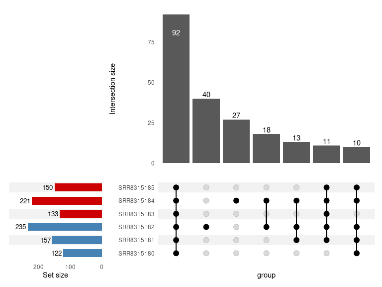
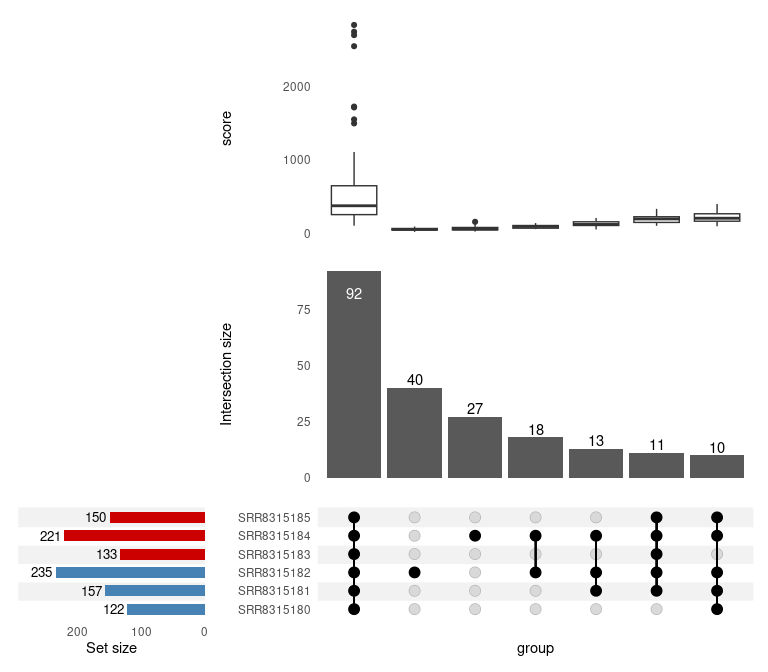

extraChIPs: Differential Signal Using Fixed-Width Windows
================
true

# Introduction

The [GRAVI](https://github.com/smped/GRAVI) workflow, for which this
package is designed, uses sliding windows for differential signal
analysis. However, the use of fixed-width windows, as is common under
DiffBind-style (Ross-Innes et al. 2012) approaches is also possible with
`extraChIPs`. This vignette focusses on using conventional peak calls
and fixed-width approaches to replicate and extend these approaches.

The majority of examples below use heavily reduced datasets to provide
general guidance on using the functions. Some results may appear trivial
as a result, but will hopefully prove far more useful in a true
experimental context. All data, along with this vignette are available
[here](https://github.com/smped/extraChIPs_vignette). Please place all
contents of the data directory in a directory named data in your own
working directory.

# Setup

## Installation

In order to use the package `extraChIPs` and follow this vignette, we
recommend using the package `BiocManager` hosted on CRAN. Once this is
installed, the additional packages required for this vignette
(`tidyverse`, `Rsamtools`, `csaw`, `BiocParallel` and `rtracklayer`) can
also be installed.

``` r
if (!"BiocManager" %in% rownames(installed.packages()))
  install.packages("BiocManager")
pkg <- c(
  "tidyverse", "Rsamtools", "csaw", "BiocParallel", "rtracklayer", "edgeR", 
  "patchwork", "extraChIPs", "plyranges", "scales", "here", "quantro"
)
BiocManager::install(pkg, update = FALSE)
```

Once these packages are installed, we can load them easily

``` r
library(tidyverse)
library(Rsamtools)
library(csaw)
library(BiocParallel)
library(rtracklayer)
library(edgeR)
library(patchwork)
library(extraChIPs)
library(plyranges)
library(scales)
library(glue)
library(ggrepel)
library(here)
library(quantro)
theme_set(theme_bw())
```

## Data

All data for this vignette is expected to be in a sub-directory of the
working directory named “data”, and all paths will be predicated on
this. Please ensure you have all data in this location, obtained from
[here](https://github.com/smped/extraChIPs_vignette).

The data itself is ChIP-Seq data targeting the Estrogen Receptor (ER),
and is taken from the cell-line ZR-75-1 cell-line using data from the
BioProject , Pre-processing was performed using the
[`prepareChIPs`](https://github.com/smped/prepareChIPs) workflow,
written in snakemake (Mölder et al. 2021) and all code is available at
<https://github.com/smped/PRJNA509779>. ER binding was assessed under
Vehicle (E2) and DHT-stimulated (E2DHT) conditions. Using GRCh37 as the
reference genome, a subset of regions found on chromosome 10 are
included in this dataset for simplicity.

First we’ll load our sample data then define our two treatment groups.
Defining a consistent colour palette for all plots is also a good habit
to develop.

``` r
samples <- here("data", "PRJNA509779.tsv") %>% 
  read_tsv() %>% 
  dplyr::filter(target == "ER") %>% 
  mutate(treatment = factor(treatment, levels = c("E2", "E2DHT")))
samples
```

    ## # A tibble: 6 × 8
    ##   accession  target treatment input      Cell_Line `Sample Name` Experiment
    ##   <chr>      <chr>  <fct>     <chr>      <chr>     <chr>         <chr>     
    ## 1 SRR8315180 ER     E2        SRR8315192 ZR-75-1   GSM3511084    SRX5128132
    ## 2 SRR8315181 ER     E2        SRR8315192 ZR-75-1   GSM3511084    SRX5128132
    ## 3 SRR8315182 ER     E2        SRR8315192 ZR-75-1   GSM3511084    SRX5128132
    ## 4 SRR8315183 ER     E2DHT     SRR8315192 ZR-75-1   GSM3511085    SRX5128133
    ## 5 SRR8315184 ER     E2DHT     SRR8315192 ZR-75-1   GSM3511085    SRX5128133
    ## 6 SRR8315185 ER     E2DHT     SRR8315192 ZR-75-1   GSM3511085    SRX5128133
    ## # ℹ 1 more variable: source_name <chr>

``` r
accessions <- samples %>% 
  split(f = .$treatment) %>% 
  lapply(pull, "accession")
treat_levels <- levels(samples$treatment)
treat_colours <- setNames(c("steelblue", "red3"), treat_levels)
```

We’ll eventually be loading counts for differential signal analysis from
a set of BamFiles, so first we’ll create a `BamFileList` with all of
these files.

``` r
bfl <- here("data", "ER", glue("{samples$accession}.bam")) %>% 
  BamFileList() %>% 
  setNames(str_remove_all(names(.), ".bam"))
file.exists(path(bfl))
```

    ## [1] TRUE TRUE TRUE TRUE TRUE TRUE

`Seqinfo` objects are the foundation of working with GRanges, so
defining an object at the start of a workflow is good practice. This is
simply enabled with `extraChIPs` by using `defineSeqinfo()` and
specifying the appropriate genome.

``` r
sq <- defineSeqinfo("GRCh37")
```

Another key preparatory step for working with peaks is to define a set
of regions as either blacklisted or grey-listed regions. The former are
known problematic regions based on each genome, with data freely
available from
<https://github.com/Boyle-Lab/Blacklist/tree/master/lists>, whilst
grey-listed regions are defined from potentially problematic regions as
detected within the input sample. For our samples code for this is
included in the previously provided repository
(<https://github.com/smped/PRJNA509779>).

``` r
greylist <- import.bed(here("data/chr10_greylist.bed"), seqinfo = sq)
blacklist <- import.bed( here("data/chr10_blacklist.bed"), seqinfo = sq)
omit_ranges <- c(greylist, blacklist)
```

# Working With Peaks

The provided dataset includes six files produced by `macs2 callpeak`
(Zhang et al. 2008) in the `narrowPeak` format, and these are able to be
easily parsed using `extraChIPs`. We’ll immediately pass our black &
grey-listed regions to our parsing function so we can exclude these
regions right from the start

``` r
peaks <- here("data", "ER", glue("{samples$accession}_peaks.narrowPeak")) %>% 
  importPeaks(seqinfo = sq, blacklist = omit_ranges)
```

This will import the peaks from all files as a single `GRangesList`
object, adding the file-name to each element by default. We can easily
modify these names if we so wish.

``` r
names(peaks) <- str_remove_all(names(peaks), "_peaks.narrowPeak")
```

Once loaded, we can easily check how similar our replicates are using
`plotOverlaps()`. When three or more sets of peaks are contained in the
`GRangesList`, an UpSet plot will be drawn by default.

``` r
plotOverlaps(
  peaks, min_size = 10, .sort_sets = FALSE, 
  set_col = treat_colours[as.character(samples$treatment)]
)
```

<figure>

<figcaption aria-hidden="true"><em>UpSet plot showing overlapping peaks
across all replicates</em></figcaption>
</figure>

Optionally, specifying a column and a suitable function will produce an
additional panel summarising that value. In the following, we’ll show
the maximum score obtained, highlighting that for peaks identified in
only one or two replicates, the overall signal intensity is generally
lower, even in the sample with the strongest signal.

``` r
plotOverlaps(
  peaks, min_size = 10, .sort_sets = FALSE, var = "score", f = "max",
   set_col = treat_colours[as.character(samples$treatment)]
)
```

<figure>

<figcaption aria-hidden="true"><em>UpSet plot showing overlapping peaks
across all replicates, with the maximum score across all replicates
shown in the upper panel.</em></figcaption>
</figure>

A common task at this point may be to define consensus peaks within each
treatment group, by retaining only the peaks found in 2 of the 3
replicates `(p = 2/3)`. The default approach is to take the union of all
ranges, with the returned object containing logical values for each
sample, as well as the number of samples where an overlapping peak was
found.

If we wish to retain any of the original columns, such as the
`macs2 callpeak` score, we can simply pass the column names to
`makeConsensus()`

``` r
consensus_e2 <- makeConsensus(peaks[accessions$E2], p = 2/3, var = "score")
consensus_e2dht <- makeConsensus(peaks[accessions$E2DHT], p = 2/3, var = "score")
```

Alternatively, we could find the centre of the peaks as part of this
process, by averaging across the estimated peak centres for each sample.
This is a very common step for ChIP-Seq data where the target is a
*transcription factor*, and also forms a key step in the DiffBind
workflow.

In the following code chunk, we first find the centre for each sample
using the information provided by `macs2`, before retaining this column
when calling `makeConsensus()`. This will return each of the individual
centre-position estimates as a list for each merged range, and using
`vapply()` we then take the mean position as our estimate for the
combined peak centre.

``` r
consensus_e2 <- peaks[accessions$E2] %>% 
  endoapply(mutate, centre = start + peak) %>% 
  makeConsensus(p = 2/3, var = "centre") %>% 
  mutate(centre = vapply(centre, mean, numeric(1)))
consensus_e2
```

    ## GRanges object with 164 ranges and 5 metadata columns:
    ##         seqnames            ranges strand |    centre SRR8315180 SRR8315181
    ##            <Rle>         <IRanges>  <Rle> | <numeric>  <logical>  <logical>
    ##     [1]    chr10 43048195-43048529      * |  43048362       TRUE       TRUE
    ##     [2]    chr10 43521739-43522260      * |  43522020       TRUE       TRUE
    ##     [3]    chr10 43540042-43540390      * |  43540272       TRUE      FALSE
    ##     [4]    chr10 43606238-43606573      * |  43606416       TRUE       TRUE
    ##     [5]    chr10 43851214-43851989      * |  43851719      FALSE       TRUE
    ##     ...      ...               ...    ... .       ...        ...        ...
    ##   [160]    chr10 99096784-99097428      * |  99097254       TRUE       TRUE
    ##   [161]    chr10 99168353-99168649      * |  99168502       TRUE       TRUE
    ##   [162]    chr10 99207868-99208156      * |  99207998      FALSE       TRUE
    ##   [163]    chr10 99331363-99331730      * |  99331595       TRUE       TRUE
    ##   [164]    chr10 99621632-99621961      * |  99621818      FALSE       TRUE
    ##         SRR8315182         n
    ##          <logical> <numeric>
    ##     [1]       TRUE         3
    ##     [2]       TRUE         3
    ##     [3]       TRUE         2
    ##     [4]       TRUE         3
    ##     [5]       TRUE         2
    ##     ...        ...       ...
    ##   [160]       TRUE         3
    ##   [161]       TRUE         3
    ##   [162]       TRUE         2
    ##   [163]       TRUE         3
    ##   [164]       TRUE         2
    ##   -------
    ##   seqinfo: 24 sequences from GRCh37 genome

``` r
consensus_e2dht <- peaks[accessions$E2DHT] %>% 
  endoapply(mutate, centre = start + peak) %>% 
  makeConsensus(p = 2/3, var = "centre") %>% 
  mutate(centre = vapply(centre, mean, numeric(1)))
```

We can also inspect these using `plotOverlaps()` provided we use a
`GRangesList` for the input. Now that we only have two elements (one for
each treatment) a VennDiagram will be generated instead of an UpSet
plot.

``` r
GRangesList(E2 = granges(consensus_e2), E2DHT = granges(consensus_e2dht)) %>% 
  plotOverlaps(set_col = treat_colours[treat_levels])
```

<figure>

<figcaption aria-hidden="true"><em>Overlap between consensus peaks
identified in a treatment-specific manner</em></figcaption>
</figure>

We can now go one step further and define the set of peaks found in
either treatment. Given we’re being inclusive here, we can leave p = 0
so any peak found in *either treatment* is included.

``` r
union_peaks <- GRangesList(
  E2 = select(consensus_e2, centre), 
  E2DHT = select(consensus_e2dht, centre)
) %>% 
  makeConsensus(var = c("centre")) %>% 
  mutate(
    centre = vapply(centre, mean, numeric(1)) %>% round(0)
  ) 
```

Now we have a set of peaks, found in at least 2/3 of samples from either
condition, with estimates of each peak’s centre. The next step would be
to set all peaks as the same width based on the centre position, with a
common width being 500bp.

In the following we’ll perform multiple operations in a single call
mutate, so let’s make sure we know what’s happening.

1.  `glue("{seqnames}:{centre}:{strand}")` uses `glue` syntax to parse
    the seqnames, centre position and strand information as a
    character-like vector with a width of only 1, and using the
    estimated centre as the Range.
2.  We then coerce this to a `GRanges` object, before resizing to the
    desired width.
3.  We also add the original (un-centred) range as an additional column,
    retaining the `GRanges` structure, but discarding anything in the
    `mcols()` element, then
4.  Using `colToRanges()`, we take the centred ranges and place them as
    the core set of GRanges for this object.

This gives a GRanges object with all original information, but with
centred peaks of a fixed width.

``` r
w <- 500
centred_peaks <- union_peaks %>% 
  mutate(
    centre = glue("{seqnames}:{centre}:{strand}") %>% 
      GRanges(seqinfo = sq) %>% 
      resize(width = w),
    union_peak = granges(.)
  ) %>% 
  colToRanges("centre")
```

# Counting Reads

Now we have our centred, fixed-width peaks, we can count reads using
`csaw::regionCounts()` (Lun and Smyth 2016). We know our fragment length
is about 200bp, so we can pass this to the function for a slightly more
sophisticated approach to counting.

``` r
se <- regionCounts(bfl, centred_peaks, ext = 200)
se
```

    ## class: RangedSummarizedExperiment 
    ## dim: 188 6 
    ## metadata(2): final.ext param
    ## assays(1): counts
    ## rownames: NULL
    ## rowData names(4): E2 E2DHT n union_peak
    ## colnames(6): SRR8315180 SRR8315181 ... SRR8315184 SRR8315185
    ## colData names(4): bam.files totals ext rlen

The `colData()` element of the returned object as the columns
*bam.files*, *totals*, *ext* and *rlen*, which are all informative and
can be supplemented with our `samples` data frame. In the following,
we’ll 1) coerce to a `tibble`, 2) `left_join()` the `samples` object, 3)
add the accession as the sample column, 4) set the accession back as the
rownames, then 5) coerce back to the required `DataFrame()` structure.

``` r
colData(se) <- colData(se) %>% 
  as_tibble(rownames = "accession") %>% 
  left_join(samples) %>% 
  mutate(sample = accession) %>% 
  as.data.frame() %>% 
  DataFrame(row.names = .$accession)
colData(se)
```

    ## DataFrame with 6 rows and 13 columns
    ##              accession              bam.files    totals       ext      rlen
    ##            <character>            <character> <integer> <integer> <integer>
    ## SRR8315180  SRR8315180 /home/steviep/github..    317845       200        75
    ## SRR8315181  SRR8315181 /home/steviep/github..    337623       200        75
    ## SRR8315182  SRR8315182 /home/steviep/github..    341998       200        75
    ## SRR8315183  SRR8315183 /home/steviep/github..    315872       200        75
    ## SRR8315184  SRR8315184 /home/steviep/github..    352908       200        75
    ## SRR8315185  SRR8315185 /home/steviep/github..    347709       200        75
    ##                 target treatment       input   Cell_Line Sample.Name
    ##            <character>  <factor> <character> <character> <character>
    ## SRR8315180          ER     E2     SRR8315192     ZR-75-1  GSM3511084
    ## SRR8315181          ER     E2     SRR8315192     ZR-75-1  GSM3511084
    ## SRR8315182          ER     E2     SRR8315192     ZR-75-1  GSM3511084
    ## SRR8315183          ER     E2DHT  SRR8315192     ZR-75-1  GSM3511085
    ## SRR8315184          ER     E2DHT  SRR8315192     ZR-75-1  GSM3511085
    ## SRR8315185          ER     E2DHT  SRR8315192     ZR-75-1  GSM3511085
    ##             Experiment    source_name      sample
    ##            <character>    <character> <character>
    ## SRR8315180  SRX5128132     ZR-75-1_E2  SRR8315180
    ## SRR8315181  SRX5128132     ZR-75-1_E2  SRR8315181
    ## SRR8315182  SRX5128132     ZR-75-1_E2  SRR8315182
    ## SRR8315183  SRX5128133 ZR-75-1_E2+DHT  SRR8315183
    ## SRR8315184  SRX5128133 ZR-75-1_E2+DHT  SRR8315184
    ## SRR8315185  SRX5128133 ZR-75-1_E2+DHT  SRR8315185

For QC and visualisation, we can add an additional `logCPM` assay to our
object as well.

``` r
assay(se, "logCPM") <- cpm(assay(se, "counts"), lib.size = se$totals, log = TRUE)
```

First we might like to check our distribution of counts

``` r
plotAssayDensities(se, assay = "counts", colour = "treat", trans = "log1p") +
  scale_colour_manual(values = treat_colours)
```

<figure>

<figcaption aria-hidden="true"><em>Count densities for all samples,
using the log+1 transformation</em></figcaption>
</figure>

A PCA plot can also provide insight as to where the variability in the
data lies.

``` r
plotAssayPCA(se, assay = "logCPM", colour = "treat", label = "sample") +
  scale_colour_manual(values = treat_colours)
```

<figure>

<figcaption aria-hidden="true"><em>PCA plot using logCPM values and
showing that replicate variability is larger than varibility between
treatment groups.</em></figcaption>
</figure>

# Differential Signal Analysis

## Statistical Testing

In order to perform Differential Signal Analysis, we simply need to
define a model matrix, as for conventional analysis using `edgeR` or
`limma`. We can then pass this, along with our fixed-width counts to
`fitAssayDiff()`. By default normalisation will be *library-size*
normalisation, as is a common default strategy for ChIP-Seq data. In
contrast to sliding window approaches, these results represent our final
results and there is no need for merging windows.

``` r
X <- model.matrix(~treatment, data = colData(se))
ls_res <- fitAssayDiff(se, design = X, asRanges = TRUE)
sum(ls_res$FDR < 0.05)
```

    ## [1] 3

TMM normalisation (Robinson and Oshlack 2010) is another common
strategy, which relies on the data from all treatment groups being drawn
from the same distributions. We can formally test this using the package
`quantro` (Hicks and Irizarry 2015) , which produces p-values for 1)
H<sub>0</sub>: Group medians are drawn from the same distribution, and
2) H<sub>0</sub>: Group-specific distributions are the same.

``` r
set.seed(100)
qtest <- assay(se, "counts") %>% 
  quantro(groupFactor = se$treatment, B = 1e3)
qtest
```

    ## quantro: Test for global differences in distributions
    ##    nGroups:  2 
    ##    nTotSamples:  6 
    ##    nSamplesinGroups:  3 3 
    ##    anovaPval:  0.90754 
    ##    quantroStat:  0.21859 
    ##    quantroPvalPerm:  0.572

Here, both p-values are \>0.05, so in conjunction with out visual
inspection earlier, we can confidently apply TMM normalisation. To apply
this, we simply specify the argument `norm = "TMM"` when we call
`fitAssayDiff()`. In the analysis below, we’ve also specified a
fold-change threshold `(fc = 1.2)`, below which, changes in signal are
considered to not be of interest (McCarthy and Smyth 2009). This
threshold is incorporated into the testing so there is no requirement
for *post-hoc* filtering based on a threshold.

``` r
tmm_res <- fitAssayDiff(se, design = X, norm = "TMM", asRanges = TRUE, fc = 1.2)
sum(tmm_res$FDR < 0.05)
```

    ## [1] 7

An MA-plot is a common way of inspecting results and in the following we
use the original ‘union_peak’ in our labelling of points. This serves as
a reminder that the fixed-width windows are in fact *a proxy* for the
entire region for which we have confidently detected ChIP signal, and
that these windows are truly the regions of interest.

``` r
tmm_res %>% 
  as_tibble() %>% 
  mutate(`FDR < 0.05` = FDR < 0.05) %>% 
  ggplot(aes(logCPM, logFC)) +
  geom_point(aes(colour = `FDR < 0.05`)) +
  geom_smooth(se = FALSE) +
  geom_label_repel(
    aes(label = union_peak), colour = "red",
    data = . %>% dplyr::filter(FDR < 0.05)
  ) +
  scale_colour_manual(values = c("black", "red"))
```

<figure>

<figcaption aria-hidden="true"><em>MA-plot after fitting using TMM
normalisation and applying a fold-change threshold during testing.
Points are labelled using the original windows obtained when merging
replicats and treatment groups.</em></figcaption>
</figure>

## Mapping to Genes

Whilst knowledge of which regions are showing differential signal, the
fundamental question we are usually asking is about the downstream
regulatory consequences, such as the target gene. Before we can map
peaks to genes, we’ll need to define our genes. In the following, we’ll
use the provided Gencode gene mappings at the gene, transcript and exon
level.

``` r
gencode <- here("data/gencode.v43lift37.chr10.annotation.gtf.gz") %>% 
  import.gff() %>% 
  filter_by_overlaps(GRanges("chr10:42354900-100000000")) %>% 
  split(.$type)
seqlevels(gencode) <- seqlevels(sq)
seqinfo(gencode) <- sq
```

Mapping to genes using `mapByFeature()` uses additional annotations,
such as whether the peak overlaps a promoter, enhancer or long-range
interaction. Here we’ll just use promoters, so let’s create a set of
promoters from our transcript-level information, ensuring we incorporate
all possible promoters within a gene, and merging any overlapping ranges
using `reduceMC()`

``` r
promoters <- gencode$transcript %>% 
    select(gene_id, ends_with("name")) %>% 
    promoters(upstream = 2500, downstream = 500) %>% 
    reduceMC(simplify = FALSE)
promoters
```

    ## GRanges object with 1678 ranges and 3 metadata columns:
    ##          seqnames            ranges strand |
    ##             <Rle>         <IRanges>  <Rle> |
    ##      [1]    chr10 42678287-42681286      + |
    ##      [2]    chr10 42702938-42705937      + |
    ##      [3]    chr10 42735669-42738668      + |
    ##      [4]    chr10 42743933-42746932      + |
    ##      [5]    chr10 42968428-42973155      + |
    ##      ...      ...               ...    ... .
    ##   [1674]    chr10 99635155-99638154      - |
    ##   [1675]    chr10 99643500-99646805      - |
    ##   [1676]    chr10 99695536-99698535      - |
    ##   [1677]    chr10 99770595-99773594      - |
    ##   [1678]    chr10 99789879-99793085      - |
    ##                                                                     gene_id
    ##                                                             <CharacterList>
    ##      [1]                                                ENSG00000237592.2_5
    ##      [2]                                                ENSG00000271650.1_7
    ##      [3]                                                ENSG00000290458.1_2
    ##      [4]                                                ENSG00000274167.5_8
    ##      [5] ENSG00000185904.12_9,ENSG00000185904.12_9,ENSG00000185904.12_9,...
    ##      ...                                                                ...
    ##   [1674]                                                  ENSG00000265398.1
    ##   [1675]                        ENSG00000095713.14_13,ENSG00000095713.14_13
    ##   [1676]                                              ENSG00000095713.14_13
    ##   [1677]                                              ENSG00000095713.14_13
    ##   [1678]                        ENSG00000095713.14_13,ENSG00000095713.14_13
    ##                                  gene_name
    ##                            <CharacterList>
    ##      [1]                       IGKV1OR10-1
    ##      [2]                   ENSG00000271650
    ##      [3]                   ENSG00000290458
    ##      [4]                   ENSG00000274167
    ##      [5] LINC00839,LINC00839,LINC00839,...
    ##      ...                               ...
    ##   [1674]                        AL139239.1
    ##   [1675]                     CRTAC1,CRTAC1
    ##   [1676]                            CRTAC1
    ##   [1677]                            CRTAC1
    ##   [1678]                     CRTAC1,CRTAC1
    ##                                        transcript_name
    ##                                        <CharacterList>
    ##      [1]                               IGKV1OR10-1-201
    ##      [2]                               ENST00000605702
    ##      [3]                               ENST00000622823
    ##      [4]                               ENST00000622650
    ##      [5] LINC00839-204,LINC00839-203,LINC00839-202,...
    ##      ...                                           ...
    ##   [1674]                                AL139239.1-201
    ##   [1675]                         CRTAC1-205,CRTAC1-206
    ##   [1676]                                    CRTAC1-204
    ##   [1677]                                    CRTAC1-201
    ##   [1678]                         CRTAC1-203,CRTAC1-202
    ##   -------
    ##   seqinfo: 24 sequences from GRCh37 genome

Now we’ll pass these to `mapByFeature()`, but first, we’ll place the
original ‘union_peak’ back as the core of the GRanges object. This will
retain all the results from testing, but ensures the correct region is
mapped to genes.

``` r
tmm_mapped_res <- tmm_res %>% 
  colToRanges("union_peak") %>% 
  mapByFeature(genes = gencode$gene, prom = promoters) %>% 
  addDiffStatus()
arrange(tmm_mapped_res, PValue)
```

    ## GRanges object with 188 ranges and 11 metadata columns:
    ##         seqnames            ranges strand |        E2     E2DHT         n
    ##            <Rle>         <IRanges>  <Rle> | <logical> <logical> <numeric>
    ##     [1]    chr10 81101906-81102928      * |      TRUE      TRUE         2
    ##     [2]    chr10 79629641-79630271      * |      TRUE      TRUE         2
    ##     [3]    chr10 89407752-89408138      * |     FALSE      TRUE         1
    ##     [4]    chr10 52233596-52233998      * |      TRUE      TRUE         2
    ##     [5]    chr10 91651138-91651433      * |     FALSE      TRUE         1
    ##     ...      ...               ...    ... .       ...       ...       ...
    ##   [184]    chr10 57899195-57899649      * |      TRUE      TRUE         2
    ##   [185]    chr10 79190987-79191351      * |     FALSE      TRUE         1
    ##   [186]    chr10 93120411-93121224      * |      TRUE      TRUE         2
    ##   [187]    chr10 84812327-84812615      * |      TRUE     FALSE         1
    ##   [188]    chr10 95755308-95755721      * |      TRUE      TRUE         2
    ##               logFC    logCPM      PValue         FDR       p_mu0
    ##           <numeric> <numeric>   <numeric>   <numeric>   <numeric>
    ##     [1]    1.871060   7.93229 3.32981e-24 6.26004e-22 5.86555e-30
    ##     [2]    0.931608   8.06748 1.77568e-07 1.66914e-05 7.16573e-11
    ##     [3]    1.570273   6.17416 6.05081e-07 3.79184e-05 6.73569e-08
    ##     [4]    1.049765   6.68775 5.82639e-05 2.73840e-03 5.28527e-06
    ##     [5]    1.539043   5.15469 1.94038e-04 7.29583e-03 6.91838e-05
    ##     ...         ...       ...         ...         ...         ...
    ##   [184]  0.01656860   6.74759    0.949645    0.970289    0.939137
    ##   [185] -0.01280716   6.39247    0.963207    0.972684    0.958637
    ##   [186] -0.02142115   9.32215    0.963659    0.972684    0.831820
    ##   [187]  0.01237140   6.19732    0.967510    0.972684    0.963156
    ##   [188] -0.00530365   5.86168    0.986505    0.986505    0.985630
    ##                                            gene_id
    ##                                    <CharacterList>
    ##     [1]                       ENSG00000108179.14_6
    ##     [2]                      ENSG00000151208.17_11
    ##     [3]   ENSG00000225913.2_9,ENSG00000196566.2_10
    ##     [4] ENSG00000198964.14_10,ENSG00000225303.2_10
    ##     [5]                        ENSG00000280560.3_9
    ##     ...                                        ...
    ##   [184]                                           
    ##   [185]                      ENSG00000156113.25_17
    ##   [186]                        ENSG00000289228.2_2
    ##   [187]                          ENSG00000200774.1
    ##   [188]                      ENSG00000138193.17_12
    ##                               gene_name    status
    ##                         <CharacterList>  <factor>
    ##     [1]                            PPIF Increased
    ##     [2]                            DLG5 Increased
    ##     [3] ENSG00000225913,ENSG00000196566 Increased
    ##     [4]           SGMS1,ENSG00000225303 Increased
    ##     [5]                       LINC01374 Increased
    ##     ...                             ...       ...
    ##   [184]                                 Unchanged
    ##   [185]                          KCNMA1 Unchanged
    ##   [186]                 ENSG00000289228 Unchanged
    ##   [187]                       RNU6-478P Unchanged
    ##   [188]                           PLCE1 Unchanged
    ##   -------
    ##   seqinfo: 24 sequences from GRCh37 genome

# Inspection of Results

## Profile Heatmaps

When analysing a transcription factor, checking the binding profile
across our treatment groups can be informative, and is often performed
using ‘Profile Heatmaps’ where coverage is smoothed within bins
surrounding our peak centre.

The function `getProfileData()` takes a set of ranges and a
BigWigFileList, and performs the smoothing, which is then passed to the
function `plotProfileHeatmap()`.

The following shows the three steps of 1) defining the ranges, 2)
obtaining the smoothed binding profiles, and 3) drawing the heatmap.
Note that we can facet the heatmaps by selecting the ‘status’ column to
separate any Increased or Decreased regions. By default, this will also
draw the smoothed lines in the top panel using different colours.

These plots can be used to show coverage-like values (SPMR or CPM) or we
can use fold-enrichment over the input sample(s), as is also produced by
`macs2 bdgcmp`. This data isn’t generally visualised using
log-transformation so we’ll set `log = FALSE` in our call to
`getProfileData()`

``` r
fe_bw <- here("data", "ER", glue("{treat_levels}_FE_chr10.bw")) %>% 
  BigWigFileList() %>% 
  setNames(treat_levels)
sig_ranges <- filter(tmm_mapped_res, FDR < 0.05)
pd_fe <- getProfileData(fe_bw, sig_ranges, log = FALSE) 
pd_fe %>% 
  plotProfileHeatmap("profile_data", facetY = "status") +
  scale_fill_gradient(low = "white", high = "red") +
  labs(fill = "Fold\nEnrichment")
```

<figure>

<figcaption aria-hidden="true"><em>Profile Heatmap showing
fold-enrichment over input samples for all sites consiered as showing
evidence of differential signal.</em></figcaption>
</figure>

## Coverage Plots

As well as showing summarised values across all sites, we may wish to
check the binding patterns in relation to other genomic features.
`plotHFGC()` enables easy visualisation of a region incorporating HiC
(H), Features (F), Genes (G) and Coverage (C), with considerable
flexibility in how many tracks are able to be shown. `plotHFGC()` relies
on the infrastructure provided by `Gviz` (Hahne and Ivanek 2016) so some
familiarity with this package is helpful, but not essential.

The minimum requirement is a GRanges object and coverage is obviously
important, so let’s choose our most highly-ranked result, which is
mapped to the gene *PPIF*, and the SPMR-based BigWigFileList.

``` r
gr <- arrange(tmm_mapped_res, PValue)[1]
gr
```

    ## GRanges object with 1 range and 11 metadata columns:
    ##       seqnames            ranges strand |        E2     E2DHT         n
    ##          <Rle>         <IRanges>  <Rle> | <logical> <logical> <numeric>
    ##   [1]    chr10 81101906-81102928      * |      TRUE      TRUE         2
    ##           logFC    logCPM      PValue         FDR       p_mu0
    ##       <numeric> <numeric>   <numeric>   <numeric>   <numeric>
    ##   [1]   1.87106   7.93229 3.32981e-24 6.26004e-22 5.86555e-30
    ##                    gene_id       gene_name    status
    ##            <CharacterList> <CharacterList>  <factor>
    ##   [1] ENSG00000108179.14_6            PPIF Increased
    ##   -------
    ##   seqinfo: 24 sequences from GRCh37 genome

In order to plot both treatments on the same track, we can pass a list
of BigWigFileList objects. By default, if a BigWigFileList is passed to
`plotHFGC()` each BigWig file will be drawn on a separate track, but
choosing to pass a list will lead to each BigWigFileList being drawn as
lines overlaid on the same track, making the addition of multiple
coverage tracks simple. Colours are required to be passed using the same
list stricture.

``` r
cov_bw <- here::here(
  "data", "ER", glue("{levels(samples$treatment)}_cov_chr10.bw")
) %>% 
  BigWigFileList() %>% 
  setNames(treat_levels)
cov_list <- list(ER = cov_bw)
cov_colours <- list(ER = treat_colours)
```

Given we used H3K27ac data in the sliding windows vignette, let’s load
H3K27ac coverage and add this to our plots.

``` r
cov_list$H3K27ac <- here::here(
  "data", "H3K27ac", glue("{levels(samples$treatment)}_cov_chr10.bw")
) %>% 
  BigWigFileList() %>% 
  setNames(treat_levels)
cov_colours$H3K27ac <- treat_colours[treat_levels]
```

Now let’s zoom out and add some cytogenetic bands for reference

``` r
data("grch37.cytobands")
plotHFGC(
  gr, 
  coverage = cov_list, linecol = cov_colours, rotation.title = 90,
  cytobands = grch37.cytobands, zoom = 20
)
```

<figure>

<figcaption aria-hidden="true"><em>Cytogentic bands are providing for
some genomes with <code>extraChIPs</code>. Ranges can also be zoomed in
or out as required.</em></figcaption>
</figure>

Next, we might like to add some genes or transcripts. First we’ll use
the exon element of our Gencode data to create a suitable object for
Gviz.

``` r
gene_models <- gencode$exon %>% 
  select(
    type, gene = gene_id, exon = exon_id, transcript = transcript_id, 
    symbol = gene_name
  ) 
plotHFGC(
  gr, 
  genes = gene_models, genecol = "wheat",
  coverage = cov_list, linecol = cov_colours, rotation.title = 90,
  cytobands = grch37.cytobands, zoom = 20
)
```

<figure>

<figcaption aria-hidden="true"><em>Genes can be added as a separate
track. Here we can see that ER binding is upstream of the gene PPIF,
with H3K27ac coverage associated with both the promoter and ER binding,
suggesting that our particular range is in an
enhancer.</em></figcaption>
</figure>

Given that we’ve already defined some promoters for our mapping to
genes, we can add these as features. We may also wish to add known
binding sites for ER as provided by Encode. The file
`esr1_chr10.hg19.bed.gz` was obtained from the UCSC Table Browser, then
filtered to only contain Chromosome 10. and this combines ER
(i.e. *ESR1*) binding sites across multiple cell lines.

``` r
esr1 <- here("data/ER/esr1_chr10.hg19.bed.gz") %>% 
  import.bed(
    colnames = c("chrom", "start", "end", "name", "score"), seqinfo = sq
  )
```

We can separate out these features onto separate tracks using a similar
strategy to our coverage tracks. If we pass a single GRangesList, all
features will be drawn on the same track, however, if we pass a list of
GRangesList objects, each list element will be drawn as a separate
track. Our colours object will also need to be specified as a list with
the same structure.

``` r
feat_list <- list(
  Promoters = GRangesList(promoters = promoters), 
  ESR1 = GRangesList(esr1 = esr1)
)
feat_colours <- list(
  Promoters = c(promoters = "yellow2"), ESR1 = c(esr1 = "royalblue")
)
plotHFGC(
  gr, 
  features = feat_list, featcol = feat_colours, featsize = 1.5,
  genes = gene_models, genecol = "wheat",
  coverage = cov_list, linecol = cov_colours, rotation.title = 90,
  cytobands = grch37.cytobands, zoom = 15, shift = 6e3,
  fontsize = 12, cex.axis = 0.8, highlight = rgb(0.7, 0.7, 1)
)
```

<figure>

<figcaption aria-hidden="true"><em>Features can also be shown on
separate tracks with informative track labels. Plots can also be shifted
and multiple parameters are also able to be customised</em></figcaption>
</figure>

Although not demonstrated here, the same principles for multiple
gene-level tracks can be applied. This is particularly useful if wishing
to plot differentially expressed genes on a separate track to those
which are undetected or unchanged.

Additional plotting functions which may be useful are also demonstrated
in the sliding windows vignette.

## Session Info

``` r
sessionInfo()
```

    ## R version 4.3.1 (2023-06-16)
    ## Platform: x86_64-pc-linux-gnu (64-bit)
    ## Running under: Ubuntu 20.04.6 LTS
    ## 
    ## Matrix products: default
    ## BLAS:   /usr/lib/x86_64-linux-gnu/blas/libblas.so.3.9.0 
    ## LAPACK: /usr/lib/x86_64-linux-gnu/lapack/liblapack.so.3.9.0
    ## 
    ## locale:
    ##  [1] LC_CTYPE=en_AU.UTF-8       LC_NUMERIC=C              
    ##  [3] LC_TIME=en_AU.UTF-8        LC_COLLATE=en_AU.UTF-8    
    ##  [5] LC_MONETARY=en_AU.UTF-8    LC_MESSAGES=en_AU.UTF-8   
    ##  [7] LC_PAPER=en_AU.UTF-8       LC_NAME=C                 
    ##  [9] LC_ADDRESS=C               LC_TELEPHONE=C            
    ## [11] LC_MEASUREMENT=en_AU.UTF-8 LC_IDENTIFICATION=C       
    ## 
    ## time zone: Australia/Adelaide
    ## tzcode source: system (glibc)
    ## 
    ## attached base packages:
    ## [1] stats4    stats     graphics  grDevices utils     datasets  methods  
    ## [8] base     
    ## 
    ## other attached packages:
    ##  [1] quantro_1.34.0              here_1.0.1                 
    ##  [3] ggrepel_0.9.3               glue_1.6.2                 
    ##  [5] scales_1.2.1                plyranges_1.20.0           
    ##  [7] extraChIPs_1.5.14           ggside_0.2.2               
    ##  [9] patchwork_1.1.2             edgeR_3.42.4               
    ## [11] limma_3.56.2                rtracklayer_1.60.0         
    ## [13] BiocParallel_1.34.2         csaw_1.34.0                
    ## [15] SummarizedExperiment_1.30.2 Biobase_2.60.0             
    ## [17] MatrixGenerics_1.12.3       matrixStats_1.0.0          
    ## [19] Rsamtools_2.16.0            Biostrings_2.68.1          
    ## [21] XVector_0.40.0              GenomicRanges_1.52.0       
    ## [23] GenomeInfoDb_1.36.1         IRanges_2.34.1             
    ## [25] S4Vectors_0.38.1            BiocGenerics_0.46.0        
    ## [27] lubridate_1.9.2             forcats_1.0.0              
    ## [29] stringr_1.5.0               dplyr_1.1.2                
    ## [31] purrr_1.0.2                 readr_2.1.4                
    ## [33] tidyr_1.3.0                 tibble_3.2.1               
    ## [35] ggplot2_3.4.3               tidyverse_2.0.0            
    ## 
    ## loaded via a namespace (and not attached):
    ##   [1] splines_4.3.1              BiocIO_1.10.0             
    ##   [3] bitops_1.0-7               filelock_1.0.2            
    ##   [5] polyclip_1.10-4            preprocessCore_1.62.1     
    ##   [7] XML_3.99-0.14              rpart_4.1.19              
    ##   [9] lifecycle_1.0.3            doParallel_1.0.17         
    ##  [11] rprojroot_2.0.3            vroom_1.6.3               
    ##  [13] base64_2.0.1               lattice_0.21-8            
    ##  [15] ensembldb_2.24.0           MASS_7.3-60               
    ##  [17] scrime_1.3.5               backports_1.4.1           
    ##  [19] magrittr_2.0.3             minfi_1.46.0              
    ##  [21] Hmisc_5.1-0                rmarkdown_2.24            
    ##  [23] yaml_2.3.7                 metapod_1.8.0             
    ##  [25] doRNG_1.8.6                askpass_1.1               
    ##  [27] Gviz_1.44.0                DBI_1.1.3                 
    ##  [29] RColorBrewer_1.1-3         abind_1.4-5               
    ##  [31] zlibbioc_1.46.0            quadprog_1.5-8            
    ##  [33] AnnotationFilter_1.24.0    biovizBase_1.48.0         
    ##  [35] RCurl_1.98-1.12            nnet_7.3-19               
    ##  [37] VariantAnnotation_1.46.0   tweenr_2.0.2              
    ##  [39] rappdirs_0.3.3             circlize_0.4.15           
    ##  [41] GenomeInfoDbData_1.2.10    genefilter_1.82.1         
    ##  [43] annotate_1.78.0            DelayedMatrixStats_1.22.5 
    ##  [45] codetools_0.2-19           DelayedArray_0.26.7       
    ##  [47] xml2_1.3.5                 ggforce_0.4.1             
    ##  [49] tidyselect_1.2.0           shape_1.4.6               
    ##  [51] futile.logger_1.4.3        farver_2.1.1              
    ##  [53] beanplot_1.3.1             ComplexUpset_1.3.3        
    ##  [55] BiocFileCache_2.8.0        base64enc_0.1-3           
    ##  [57] illuminaio_0.42.0          GenomicAlignments_1.36.0  
    ##  [59] multtest_2.56.0            GetoptLong_1.0.5          
    ##  [61] Formula_1.2-5              survival_3.5-5            
    ##  [63] iterators_1.0.14           foreach_1.5.2             
    ##  [65] tools_4.3.1                progress_1.2.2            
    ##  [67] Rcpp_1.0.11                gridExtra_2.3             
    ##  [69] mgcv_1.9-0                 xfun_0.40                 
    ##  [71] HDF5Array_1.28.1           withr_2.5.0               
    ##  [73] formatR_1.14               fastmap_1.1.1             
    ##  [75] rhdf5filters_1.12.1        latticeExtra_0.6-30       
    ##  [77] fansi_1.0.4                openssl_2.1.0             
    ##  [79] digest_0.6.33              timechange_0.2.0          
    ##  [81] R6_2.5.1                   colorspace_2.1-0          
    ##  [83] jpeg_0.1-10                dichromat_2.0-0.1         
    ##  [85] biomaRt_2.56.1             RSQLite_2.3.1             
    ##  [87] utf8_1.2.3                 generics_0.1.3            
    ##  [89] data.table_1.14.8          prettyunits_1.1.1         
    ##  [91] InteractionSet_1.28.1      httr_1.4.6                
    ##  [93] htmlwidgets_1.6.2          S4Arrays_1.0.5            
    ##  [95] pkgconfig_2.0.3            gtable_0.3.3              
    ##  [97] blob_1.2.4                 siggenes_1.74.0           
    ##  [99] ComplexHeatmap_2.16.0      htmltools_0.5.6           
    ## [101] ProtGenerics_1.32.0        clue_0.3-64               
    ## [103] png_0.1-8                  knitr_1.43                
    ## [105] lambda.r_1.2.4             rstudioapi_0.15.0         
    ## [107] tzdb_0.4.0                 rjson_0.2.21              
    ## [109] nlme_3.1-162               checkmate_2.2.0           
    ## [111] curl_5.0.2                 bumphunter_1.42.0         
    ## [113] rhdf5_2.44.0               cachem_1.0.8              
    ## [115] GlobalOptions_0.1.2        parallel_4.3.1            
    ## [117] foreign_0.8-84             AnnotationDbi_1.62.2      
    ## [119] restfulr_0.0.15            GEOquery_2.68.0           
    ## [121] reshape_0.8.9              pillar_1.9.0              
    ## [123] grid_4.3.1                 vctrs_0.6.3               
    ## [125] dbplyr_2.3.3               xtable_1.8-4              
    ## [127] cluster_2.1.4              htmlTable_2.4.1           
    ## [129] evaluate_0.21              VennDiagram_1.7.3         
    ## [131] EnrichedHeatmap_1.30.0     GenomicFeatures_1.52.1    
    ## [133] cli_3.6.1                  locfit_1.5-9.8            
    ## [135] compiler_4.3.1             futile.options_1.0.1      
    ## [137] rngtools_1.5.2             rlang_1.1.1               
    ## [139] crayon_1.5.2               labeling_0.4.2            
    ## [141] nor1mix_1.3-0              mclust_6.0.0              
    ## [143] interp_1.1-4               plyr_1.8.8                
    ## [145] pander_0.6.5               stringi_1.7.12            
    ## [147] deldir_1.0-9               munsell_0.5.0             
    ## [149] lazyeval_0.2.2             Matrix_1.6-1              
    ## [151] BSgenome_1.68.0            hms_1.1.3                 
    ## [153] sparseMatrixStats_1.12.2   bit64_4.0.5               
    ## [155] Rhdf5lib_1.22.0            KEGGREST_1.40.0           
    ## [157] highr_0.10                 igraph_1.5.1              
    ## [159] broom_1.0.5                memoise_2.0.1             
    ## [161] bit_4.0.5                  GenomicInteractions_1.34.0

## References

<div id="refs" class="references csl-bib-body hanging-indent">

<div id="ref-gviz" class="csl-entry">

Hahne, Florian, and Robert Ivanek. 2016. “Statistical Genomics: Methods
and Protocols.” In, edited by Ewy Mathé and Sean Davis, 335–51. New
York, NY: Springer New York.
<https://doi.org/10.1007/978-1-4939-3578-9_16>.

</div>

<div id="ref-Hicks2015-ee" class="csl-entry">

Hicks, Stephanie C, and Rafael A Irizarry. 2015. “Quantro: A Data-Driven
Approach to Guide the Choice of an Appropriate Normalization Method.”
*Genome Biol.* 16 (1): 117.

</div>

<div id="ref-csaw2016" class="csl-entry">

Lun, Aaron T L, and Gordon K Smyth. 2016. “Csaw: A Bioconductor Package
for Differential Binding Analysis of ChIP-Seq Data Using Sliding
Windows.” *Nucleic Acids Res.* 44 (5): e45.

</div>

<div id="ref-McCarthy2009-qf" class="csl-entry">

McCarthy, Davis J, and Gordon K Smyth. 2009. “Testing Significance
Relative to a Fold-Change Threshold Is a TREAT.” *Bioinformatics* 25
(6): 765–71.

</div>

<div id="ref-Molder2021-mo" class="csl-entry">

Mölder, Felix, Kim Philipp Jablonski, Brice Letcher, Michael B Hall,
Christopher H Tomkins-Tinch, Vanessa Sochat, Jan Forster, et al. 2021.
“Sustainable Data Analysis with Snakemake.” *F1000Res.* 10 (January):
33.

</div>

<div id="ref-Robinson2010-qp" class="csl-entry">

Robinson, Mark D, and Alicia Oshlack. 2010. “A Scaling Normalization
Method for Differential Expression Analysis of
<span class="nocase">RNA-seq</span> Data.” *Genome Biol.* 11 (3): R25.

</div>

<div id="ref-DiffBind2012" class="csl-entry">

Ross-Innes, Caryn S., Rory Stark, Andrew E. Teschendorff, Kelly A.
Holmes, H. Raza Ali, Mark J. Dunning, Gordon D. Brown, et al. 2012.
“Differential Oestrogen Receptor Binding Is Associated with Clinical
Outcome in Breast Cancer.” *Nature* 481: –4.
<http://www.nature.com/nature/journal/v481/n7381/full/nature10730.html>.

</div>

<div id="ref-Zhang2008-ms" class="csl-entry">

Zhang, Yong, Tao Liu, Clifford A Meyer, Jérôme Eeckhoute, David S
Johnson, Bradley E Bernstein, Chad Nusbaum, et al. 2008. “Model-Based
Analysis of ChIP-Seq (MACS).” *Genome Biol.* 9 (9): R137.

</div>

</div>

<br>
