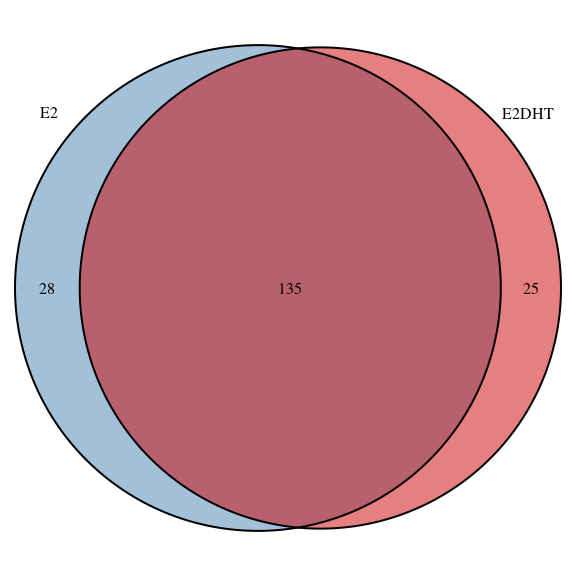
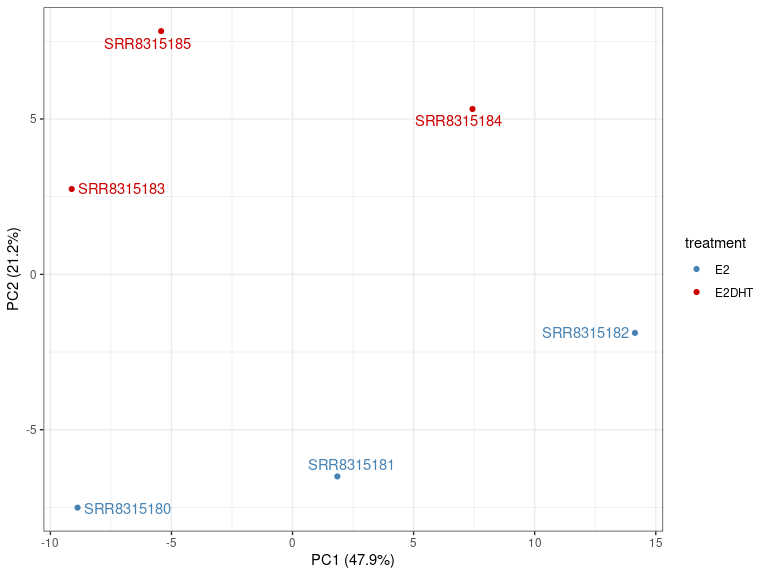

extraChIPs: Differential Signal Using Fixed-Width Windows
================
true

# Introduction

The [GRAVI](https://github.com/smped/GRAVI) workflow, for which this
package is designed, uses sliding windows for differential signal
analysis. However, the use of fixed-width windows, as is common under
DiffBind-style (Ross-Innes et al. 2012) approaches is also possible with
`extraChIPs`. This vignette focusses on using conventional peak calls
and fixed-width approaches to replicate and extend these approaches.

The majority of examples below use heavily reduced datasets to provide
general guidance on using the functions. Some results may appear trivial
as a result, but will hopefully prove far more useful in a true
experimental context. All data, along with this vignette are available
[here](https://github.com/smped/extraChIPs_vignette). Please place all
contents of the data directory in a directory named data in your own
working directory.

# Setup

## Installation

In order to use the package `extraChIPs` and follow this vignette, we
recommend using the package `BiocManager` hosted on CRAN. Once this is
installed, the additional packages required for this vignette
(`tidyverse`, `Rsamtools`, `csaw`, `BiocParallel` and `rtracklayer`) can
also be installed.

``` r
if (!"BiocManager" %in% rownames(installed.packages()))
  install.packages("BiocManager")
pkg <- c(
  "tidyverse", "Rsamtools", "csaw", "BiocParallel", "rtracklayer", "edgeR", 
  "patchwork", "extraChIPs", "plyranges", "scales", "here"
)
BiocManager::install(pkg, update = FALSE)
```

Once these packages are installed, we can load them easily

``` r
library(tidyverse)
library(Rsamtools)
library(csaw)
library(BiocParallel)
library(rtracklayer)
library(edgeR)
library(patchwork)
library(extraChIPs)
library(plyranges)
library(scales)
library(glue)
library(ggrepel)
library(here)
theme_set(theme_bw())
```

## Data

All data for this vignette is expected to be in a sub-directory of the
working directory named “data”, and all paths will be predicated on
this. Please ensure you have all data in this location, obtained from
[here](https://github.com/smped/extraChIPs_vignette).

The data itself is ChIP-Seq data targeting the Estrogen Receptor (ER),
and is taken from the cell-line ZR-75-1 cell-line using data from the
BioProject , Preprocessing was performed using the
[`prepareChIPs`](https://github.com/smped/prepareChIPs) workflow,
written in snakemake (Mölder et al. 2021) and all code is available at
<https://github.com/smped/PRJNA509779>. ER binding was assessed under
Vehicle (E2) and DHT-stimulated (E2DHT) conditions. Using GRCh37 as the
reference genome, a subset of regions found on chromosome 10 are
included in this dataset for simplicity.

First we’ll load our sample data then define our two treatment groups.
Defining a consistent colour palette for all plots is also a good habit
to develop.

``` r
samples <- here("data", "PRJNA509779.tsv") %>% 
  read_tsv() %>% 
  dplyr::filter(target == "ER") %>% 
  mutate(treatment = factor(treatment, levels = c("E2", "E2DHT")))
samples
```

    ## # A tibble: 6 × 8
    ##   accession  target treatment input      Cell_Line `Sample Name` Experiment
    ##   <chr>      <chr>  <fct>     <chr>      <chr>     <chr>         <chr>     
    ## 1 SRR8315180 ER     E2        SRR8315192 ZR-75-1   GSM3511084    SRX5128132
    ## 2 SRR8315181 ER     E2        SRR8315192 ZR-75-1   GSM3511084    SRX5128132
    ## 3 SRR8315182 ER     E2        SRR8315192 ZR-75-1   GSM3511084    SRX5128132
    ## 4 SRR8315183 ER     E2DHT     SRR8315192 ZR-75-1   GSM3511085    SRX5128133
    ## 5 SRR8315184 ER     E2DHT     SRR8315192 ZR-75-1   GSM3511085    SRX5128133
    ## 6 SRR8315185 ER     E2DHT     SRR8315192 ZR-75-1   GSM3511085    SRX5128133
    ## # ℹ 1 more variable: source_name <chr>

``` r
accessions <- samples %>% 
  split(f = .$treatment) %>% 
  lapply(pull, "accession")
treat_levels <- levels(samples$treatment)
treat_colours <- setNames(c("steelblue", "red3"), treat_levels)
```

We’ll eventually be loading counts for differential signal analysis from
a set of BamFiles, so first we’ll create a `BamFileList` with all of
these files. This also enables creation of a `Seqinfo` object based on
the actual reference genome to which the reads were aligned during data
preparation. `Seqinfo` objects are the foundation of working with
GRanges, so defining an object at the start of a workflow is good
practice.

``` r
bfl <- here("data", "ER", glue("{samples$accession}.bam")) %>% 
  BamFileList() %>% 
  setNames(str_remove_all(names(.), ".bam"))
file.exists(path(bfl))
```

    ## [1] TRUE TRUE TRUE TRUE TRUE TRUE

``` r
sq <- seqinfo(bfl)
isCircular(sq) <- rep(FALSE, length(seqlevels(sq)))
genome(sq) <- "GRCh37"
```

Another key preparatory step for working with peaks is to define a set
of regions as either blacklisted or greylisted regions. The former are
known problematic regions based on each genome, with data freely
available from
<https://github.com/Boyle-Lab/Blacklist/tree/master/lists>, whilst
grey-listed regions are defined from potentially problematic regions as
detected within the input sample. For our samples code for this is
included in the previously provided repository
(<https://github.com/smped/PRJNA509779>).

``` r
greylist <- import.bed(here("data/chr10_greylist.bed"), seqinfo = sq)
blacklist <- import.bed( here("data/chr10_blacklist.bed"), seqinfo = sq)
omit_ranges <- c(greylist, blacklist)
```

# Working With Peaks

The provided dataset includes six files produced by `macs2 callpeak`
(Zhang et al. 2008) in the `narrowPeak` format, and these are able to be
easily parsed using `extraChIPs`. We’ll immediately pass our black &
greylisted regions to our parsing function so we can exclude these
regions right from the start

``` r
peaks <- here("data", "ER", glue("{samples$accession}_peaks.narrowPeak")) %>% 
  importPeaks(seqinfo = sq, blacklist = omit_ranges)
```

This will import the peaks from all files as a single `GRangesList`
object, adding the file-name to each element by default. We can easily
modify these names if we so wish.

``` r
names(peaks) <- str_remove_all(names(peaks), "_peaks.narrowPeak")
```

Once loaded, we can easily check how similar our replicates are using
`plotOverlaps()`. When three or more sets of peaks are contained in the
`GRangesList`, an UpSet plot will be drawn by deafult.

``` r
plotOverlaps(
  peaks, min_size = 10, .sort_sets = FALSE, 
  set_col = treat_colours[as.character(samples$treatment)]
)
```

<figure>

<figcaption aria-hidden="true"><em>UpSet plot showing overlapping peaks
across all replicates</em></figcaption>
</figure>

Optionally, specifying a column and a suitable function will produce an
additional panel summarising that value. In the following, we’ll show
the maximum score obtained, highlighting that for peaks identified in
only one or two replicates, the overall signal intensity is generally
lower, even in the sample with the strongest signal.

``` r
plotOverlaps(
  peaks, min_size = 10, .sort_sets = FALSE, var = "score", f = "max",
   set_col = treat_colours[as.character(samples$treatment)]
)
```

<figure>

<figcaption aria-hidden="true"><em>UpSet plot showing overlapping peaks
across all replicates, with the maximum score across all replicates
shown in the upper panel.</em></figcaption>
</figure>

A common task at this point may be to define consensus peaks within each
treatment group, by retaining only the peaks found in 2 of the 3
replicates `(p = 2/3)`. The default approach is to take the union of all
ranges, with the returned object containing logical values for each
sample, as well as the number of samples where an overlapping peak was
found.

If we wish to retain any of the original columns, such as the
`macs2 callpeak` score, we can simply pass the column names to
`makeConsensus()`

``` r
consensus_e2 <- makeConsensus(peaks[accessions$E2], p = 2/3, var = "score")
consensus_e2dht <- makeConsensus(peaks[accessions$E2DHT], p = 2/3, var = "score")
```

Alternatively, we could find the centre of the peaks as part of this
process, by averaging across the estimated peak centres for each sample.
This is a very common step for ChIP-Seq data where the target is a
*transcription factor*, and also forms a key step in the DiffBind
workflow.

In the following code chunk, we first find the centre for each sample
using the information provided by `macs2`, before retaining this column
when calling `makeConsensus()`. This will return each of the individual
centre-position estimates as a list for each merged range, and using
`vapply()` we then take the mean position as our estimate for the
combined peak centre.

``` r
consensus_e2 <- peaks[accessions$E2] %>% 
  endoapply(mutate, centre = start + peak) %>% 
  makeConsensus(p = 2/3, var = "centre") %>% 
  mutate(centre = vapply(centre, mean, numeric(1)))
consensus_e2
```

    ## GRanges object with 164 ranges and 5 metadata columns:
    ##         seqnames            ranges strand |    centre SRR8315180 SRR8315181
    ##            <Rle>         <IRanges>  <Rle> | <numeric>  <logical>  <logical>
    ##     [1]    chr10 43048195-43048529      * |  43048362       TRUE       TRUE
    ##     [2]    chr10 43521739-43522260      * |  43522020       TRUE       TRUE
    ##     [3]    chr10 43540042-43540390      * |  43540272       TRUE      FALSE
    ##     [4]    chr10 43606238-43606573      * |  43606416       TRUE       TRUE
    ##     [5]    chr10 43851214-43851989      * |  43851719      FALSE       TRUE
    ##     ...      ...               ...    ... .       ...        ...        ...
    ##   [160]    chr10 99096784-99097428      * |  99097254       TRUE       TRUE
    ##   [161]    chr10 99168353-99168649      * |  99168502       TRUE       TRUE
    ##   [162]    chr10 99207868-99208156      * |  99207998      FALSE       TRUE
    ##   [163]    chr10 99331363-99331730      * |  99331595       TRUE       TRUE
    ##   [164]    chr10 99621632-99621961      * |  99621818      FALSE       TRUE
    ##         SRR8315182         n
    ##          <logical> <numeric>
    ##     [1]       TRUE         3
    ##     [2]       TRUE         3
    ##     [3]       TRUE         2
    ##     [4]       TRUE         3
    ##     [5]       TRUE         2
    ##     ...        ...       ...
    ##   [160]       TRUE         3
    ##   [161]       TRUE         3
    ##   [162]       TRUE         2
    ##   [163]       TRUE         3
    ##   [164]       TRUE         2
    ##   -------
    ##   seqinfo: 84 sequences from GRCh37 genome

``` r
consensus_e2dht <- peaks[accessions$E2DHT] %>% 
  endoapply(mutate, centre = start + peak) %>% 
  makeConsensus(p = 2/3, var = "centre") %>% 
  mutate(centre = vapply(centre, mean, numeric(1)))
```

We can also inspect these using `plotOverlaps()` provided we use a
`GRangesList` for the input. Now that we only have two elements (one for
each treatment) a VennDiagram will be generated instead of an UpSet
plot.

``` r
GRangesList(E2 = granges(consensus_e2), E2DHT = granges(consensus_e2dht)) %>% 
  plotOverlaps(set_col = treat_colours[treat_levels])
```

<figure>

<figcaption aria-hidden="true"><em>Overlap between consensus peaks
identified in a treatment-specific manner</em></figcaption>
</figure>

We can now go one step further and define the set of peaks found in
either treatment. Given we’re being inclusive here, we can leave p = 0
so any peak found in *either treatment* is included.

``` r
union_peaks <- GRangesList(
  E2 = select(consensus_e2, centre), 
  E2DHT = select(consensus_e2dht, centre)
) %>% 
  makeConsensus(var = c("centre")) %>% 
  mutate(
    centre = vapply(centre, mean, numeric(1)) %>% round(0)
  ) 
```

Now we have a set of peaks, found in at least 2/3 of samples from either
condition, with estimates of each peak’s centre. The next step would be
to set all peaks as the same width based on the centre position, with a
common width being 500bp.

In the following we’ll prform multiple operations in a single call
mutate, so let’s make sure we know what’s happening.

1.  `glue("{seqnames}:{centre}:{strand}")` uses `glue` syntax to parse
    the seqnames, centre position and strand information as a
    character-like vector with a width of only 1, and using the
    estimated centre as the Range.
2.  We then coerce this to a `GRanges` object, before resizing to the
    desired width.
3.  We also add the original (un-centred) range as an additional column,
    retaining the `GRanges` structure, but discarding anything in the
    `mcols()` element, then
4.  Using `colToRanges()`, we take the centred ranges and place them as
    the core set of GRanges for this object.

This gives a GRanges object with all original information, but with
centred peaks of a fixed width.

``` r
w <- 500
centred_peaks <- union_peaks %>% 
  mutate(
    centre = glue("{seqnames}:{centre}:{strand}") %>% 
      GRanges(seqinfo = sq) %>% 
      resize(width = w),
    union_peak = granges(.)
  ) %>% 
  colToRanges("centre")
```

# Counting Reads

Now we have our centred, fixed-width peaks, we can count reads using
`csaw::regionCounts()` (Lun and Smyth 2016). We know our fragment length
is about 200bp, so we can pass this to the function for a slightly more
sophisticated approach to counting.

``` r
se <- regionCounts(bfl, centred_peaks, ext = 200)
se
```

    ## class: RangedSummarizedExperiment 
    ## dim: 188 6 
    ## metadata(2): final.ext param
    ## assays(1): counts
    ## rownames: NULL
    ## rowData names(4): E2 E2DHT n union_peak
    ## colnames(6): SRR8315180 SRR8315181 ... SRR8315184 SRR8315185
    ## colData names(4): bam.files totals ext rlen

The `colData()` element of the returned object as the columns
*bam.files*, *totals*, *ext* and *rlen*, which are all informative and
can be supplemented with our `samples` data frame. In the following,
we’ll 1) coerce to a `tibble`, 2) `left_join()` the `samples` object, 3)
add the accession as the sample column, 4) set the accession back as the
rownames, then 5) coerce back to the required `DataFrame()` structure.

``` r
colData(se) <- colData(se) %>% 
  as_tibble(rownames = "accession") %>% 
  left_join(samples) %>% 
  mutate(sample = accession) %>% 
  as.data.frame() %>% 
  column_to_rownames("accession") %>% 
  DataFrame()
colData(se)
```

    ## DataFrame with 6 rows and 12 columns
    ##                         bam.files    totals       ext      rlen      target
    ##                       <character> <integer> <integer> <integer> <character>
    ## SRR8315180 /home/steviep/github..    317845       200        75          ER
    ## SRR8315181 /home/steviep/github..    337623       200        75          ER
    ## SRR8315182 /home/steviep/github..    341998       200        75          ER
    ## SRR8315183 /home/steviep/github..    315872       200        75          ER
    ## SRR8315184 /home/steviep/github..    352908       200        75          ER
    ## SRR8315185 /home/steviep/github..    347709       200        75          ER
    ##            treatment       input   Cell_Line Sample.Name  Experiment
    ##             <factor> <character> <character> <character> <character>
    ## SRR8315180     E2     SRR8315192     ZR-75-1  GSM3511084  SRX5128132
    ## SRR8315181     E2     SRR8315192     ZR-75-1  GSM3511084  SRX5128132
    ## SRR8315182     E2     SRR8315192     ZR-75-1  GSM3511084  SRX5128132
    ## SRR8315183     E2DHT  SRR8315192     ZR-75-1  GSM3511085  SRX5128133
    ## SRR8315184     E2DHT  SRR8315192     ZR-75-1  GSM3511085  SRX5128133
    ## SRR8315185     E2DHT  SRR8315192     ZR-75-1  GSM3511085  SRX5128133
    ##               source_name      sample
    ##               <character> <character>
    ## SRR8315180     ZR-75-1_E2  SRR8315180
    ## SRR8315181     ZR-75-1_E2  SRR8315181
    ## SRR8315182     ZR-75-1_E2  SRR8315182
    ## SRR8315183 ZR-75-1_E2+DHT  SRR8315183
    ## SRR8315184 ZR-75-1_E2+DHT  SRR8315184
    ## SRR8315185 ZR-75-1_E2+DHT  SRR8315185

For QC and visualisation, we can add an additional `logCPM` assay to our
object as well.

``` r
assay(se, "logCPM") <- cpm(assay(se, "counts"), lib.size = se$totals, log = TRUE)
```

First we might like to check our distribution of counts

``` r
plotAssayDensities(se, assay = "counts", colour = "treat", trans = "log1p") +
  scale_colour_manual(values = treat_colours)
```

<figure>

<figcaption aria-hidden="true"><em>Count densities for all samples,
using the log+1 transformation</em></figcaption>
</figure>

An RLE plot also can be informative

``` r
plotAssayRle(se, assay = "logCPM", fill = "treat") +
  scale_fill_manual(values = treat_colours)
```

<figure>

<figcaption aria-hidden="true"><em>RLE plot using logCPM
values</em></figcaption>
</figure>

Finally a PCA plot can also provide insight as to where the variaibility
in the data lies.

``` r
plotAssayPCA(se, assay = "logCPM", colour = "treat", label = "sample") +
  scale_colour_manual(values = treat_colours)
```

<figure>

<figcaption aria-hidden="true"><em>PCA plot using logCPM values and
showing that replicate variability is larger than varibility between
treatment groups.</em></figcaption>
</figure>

# Differential Signal Analysis

``` r
knitr::opts_chunk$set(eval = FALSE)
```

``` r
X <- model.matrix(~treatment, data = colData(se))
ls_res <- fitAssayDiff(se, design = X, asRanges = TRUE)
sum(ls_res$FDR < 0.05)
```

``` r
tmm_res <- fitAssayDiff(se, design = X, norm = "TMM", asRanges = TRUE, fc = 1.2)
sum(tmm_res$FDR < 0.05)
```

``` r
tmm_res %>% 
  as_tibble() %>% 
  mutate(`FDR < 0.05` = FDR < 0.05) %>% 
  ggplot(aes(logCPM, logFC)) +
  geom_point(aes(colour = `FDR < 0.05`)) +
  geom_smooth(method = "lm", se = FALSE) +
  geom_label_repel(
    aes(label = union_peak), colour = "red",
    data = . %>% dplyr::filter(FDR < 0.05)
  ) +
  scale_colour_manual(values = c("black", "red"))
```

``` r
gencode <- here("data/gencode.v43lift37.chr10.annotation.gtf.gz") %>% 
  import.gff() %>% 
  filter_by_overlaps(GRanges("chr10:42354900-100000000")) %>% 
  split(.$type)
seqlevels(gencode) <- seqlevels(sq)
seqinfo(gencode) <- sq
```

``` r
tss <- gencode$transcript %>% 
  resize(width = 1, fix = "start") %>% 
  select(gene_id, ends_with("name")) %>% 
  reduceMC(min.gapwidth = 0)
promoters <- gencode$transcript %>% 
    select(gene_id, ends_with("name")) %>% 
    promoters(upstream = 2500, downstream = 500) %>% 
    reduceMC(simplify = FALSE)
```

``` r
tmm_mapped_res <- tmm_res %>% 
  colToRanges("union_peak") %>% 
  mapByFeature(genes = gencode$gene, prom = promoters)
```

``` r
esr1 <- here("data/ER/esr1_chr10.hg19.bed.gz") %>% 
  import.bed(
    colnames = c("chrom", "start", "end", "name", "score"), seqinfo = sq
  ) %>% 
  keepStandardChromosomes()
```

``` r
tmm_res %>% 
  distanceToNearest(esr1) %>% 
  as_tibble() %>% 
  arrange(distance) %>% 
  mutate(p = seq_along(distance) / nrow(.)) %>% 
  ggplot(aes(distance/1e3, p)) +
  geom_line()
```

# Coverage Plots

``` r
data("grch37.cytobands")
head(grch37.cytobands)
bwfl <- here::here(
  "data", "ER", glue("{levels(samples$treatment)}_cov_chr10.bw")
) %>% 
  BigWigFileList() %>% 
  setNames(treat_levels)
```

``` r
gr <- tmm_res %>% 
  arrange(PValue) %>% 
  filter(FDR < 0.05) %>% 
  colToRanges("union_peak") %>% 
  # filter_by_overlaps(tss) %>%
  .[1]
gr <- keepStandardChromosomes(gr)
plotHFGC(gr, coverage = bwfl, cytobands = grch37.cytobands)
```

``` r
cov_list <- list(ER = bwfl)
cov_colour <- list(ER = treat_colours[treat_levels])
gene_models <- gencode$exon %>% 
  select(
    type, gene = gene_id, exon = exon_id, transcript = transcript_id, 
    symbol = gene_name
  ) %>% 
  keepStandardChromosomes()
```

``` r
plotHFGC(
  gr, cytobands = grch37.cytobands, 
  coverage =  cov_list, linecol = cov_colour,
  genes = gene_models, genecol = "wheat", collapseTranscripts = FALSE,
  zoom = 50, rotation.title = 90, covsize = 10, genesize = 1
)
```

``` r
cov_list$H3K27ac <- here::here(
  "data", "H3K27ac", glue("{levels(samples$treatment)}_cov_chr10.bw")
) %>% 
  BigWigFileList() %>% 
  setNames(treat_levels)
cov_colour$H3K27ac <- treat_colours[treat_levels]
```

``` r
feat_list <- list(
  Promoters = GRangesList(Promoter = keepStandardChromosomes(promoters)),
  ESR1 = GRangesList(ESR1 = esr1)
)
plotHFGC(
  gr, cytobands = grch37.cytobands, 
  features = feat_list,
  featcol = list(Promoters = list(Promoter = "yellow2"), ESR1 = list(ESR1 = "royalblue")),
  coverage =  cov_list, linecol = cov_colour,
  genes = gene_models, genecol = "wheat", collapseTranscripts = FALSE,
  zoom = 15, shift = 5e3, rotation.title = 90
)
```

## Profile Heatmaps

``` r
sig_ranges <- filter(tmm_res, FDR < 0.05)
pd <- getProfileData(bwfl, sig_ranges)
plotProfileHeatmap(pd, "profile_data") +
  scale_fill_gradient(low = "white", high = "red") +
  labs(fill = "logCPM")
```

``` r
fe_bwfl <- here("data", "ER", glue("{treat_levels}_FE_chr10.bw")) %>% 
  BigWigFileList() %>% 
  setNames(treat_levels)
fe_bwfl %>% 
  getProfileData(sig_ranges, log = FALSE) %>% 
  plotProfileHeatmap("profile_data") +
  scale_fill_gradient(low = "white", high = "red") +
  labs(fill = "Fold\nEnrichment")
```

<div id="refs" class="references csl-bib-body hanging-indent">

<div id="ref-csaw2016" class="csl-entry">

Lun, Aaron T L, and Gordon K Smyth. 2016. “Csaw: A Bioconductor Package
for Differential Binding Analysis of ChIP-Seq Data Using Sliding
Windows.” *Nucleic Acids Res.* 44 (5): e45.

</div>

<div id="ref-Molder2021-mo" class="csl-entry">

Mölder, Felix, Kim Philipp Jablonski, Brice Letcher, Michael B Hall,
Christopher H Tomkins-Tinch, Vanessa Sochat, Jan Forster, et al. 2021.
“Sustainable Data Analysis with Snakemake.” *F1000Res.* 10 (January):
33.

</div>

<div id="ref-DiffBind2012" class="csl-entry">

Ross-Innes, Caryn S., Rory Stark, Andrew E. Teschendorff, Kelly A.
Holmes, H. Raza Ali, Mark J. Dunning, Gordon D. Brown, et al. 2012.
“Differential Oestrogen Receptor Binding Is Associated with Clinical
Outcome in Breast Cancer.” *Nature* 481: –4.
<http://www.nature.com/nature/journal/v481/n7381/full/nature10730.html>.

</div>

<div id="ref-Zhang2008-ms" class="csl-entry">

Zhang, Yong, Tao Liu, Clifford A Meyer, Jérôme Eeckhoute, David S
Johnson, Bradley E Bernstein, Chad Nusbaum, et al. 2008. “Model-Based
Analysis of ChIP-Seq (MACS).” *Genome Biol.* 9 (9): R137.

</div>

</div>
